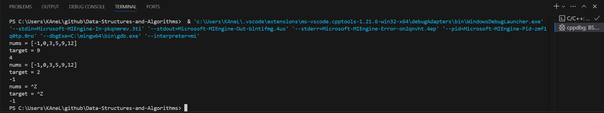
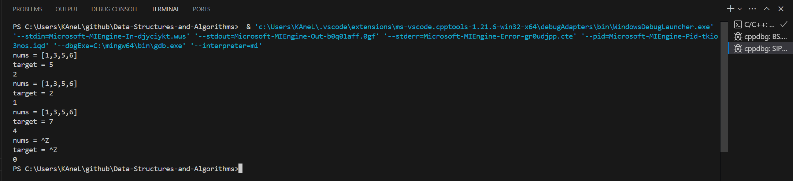
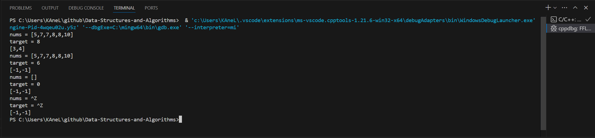
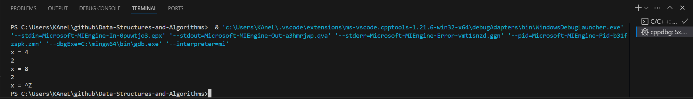
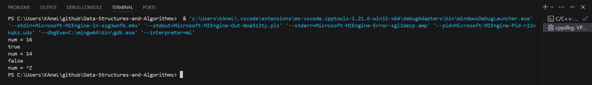
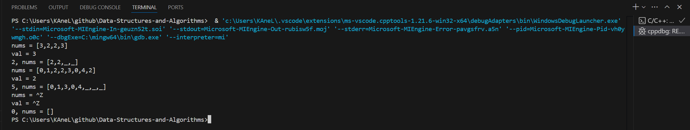

# Day1 content

[A. Binary Search](#a-binary-search)
[B. Search Insert Position](#b-search-insert-position)
[C. Find First and Last Position of Element in Sorted Array](#c-find-first-and-last-position-of-element-in-sorted-array)
[D. Sqrt(x)](#d-sqrtx)
[E. Valid Perfect Square](#e-valid-perfect-square)
[F. Remove Element](#f-remove-element)


## A. Binary Search

Given an array of integers `nums` which is sorted in ascending order, and an integer `target`, write a function to search `target` in `nums`. If `target` exists, then return its index. Otherwise, return `-1`.

You must write an algorithm with `O(log n)` runtime complexity.


**Example 1:**
> **Input:** nums = [-1,0,3,5,9,12], target = 9
> **Output:** 4
> **Explanation:** 9 exists in nums and its index is 4


**Example 2:**
> **Input:** nums = [-1,0,3,5,9,12], target = 2
> **Output:** -1
> **Explanation:** 2 does not exist in nums so return -1


**Constraints:**
- 1 <= nums.length <= $10^4$
- $-10^4$ < nums[i], target < $10^4$
- All the integers in `nums` are **unique**.
- `nums` is sorted in ascending order.


```c++
class Solution {
public:
    int search(vector<int>& nums, int target) {
        
    }
};
```

[Solution](BS.cpp)




## B. Search Insert Position

Given a sorted array of distinct integers and a target value, return the index if the target is found. If not, return the index where it would be if it were inserted in order.

You must write an algorithm with `O(log n)` runtime complexity.


**Example 1:**

> **Input:** nums = [1,3,5,6], target = 5
> **Output:** 2


**Example 2:**

> **Input:** nums = [1,3,5,6], target = 2
> **Output:** 1


**Example 3:**

> **Input:** nums = [1,3,5,6], target = 7
> **Output:** 4


**Constraints:**

- 1 <= nums.length <= $10^4$
- $-10^4$ <= nums[i] <= $10^4$
- `nums` contains **distinct** values sorted in **ascending** order.
- $-10^4$ <= target <= $10^4$


```c++
class Solution {
public:
    int searchInsert(vector<int>& nums, int target) {
        
    }
};
```

[Solution](SIP.cpp)




## C. Find First and Last Position of Element in Sorted Array

Given an array of integers `nums` sorted in non-decreasing order, find the starting and ending position of a given `target` value.

If `target` is not found in the array, return `[-1, -1]`.

You must write an algorithm with `O(log n)` runtime complexity.


**Example 1:**

> **Input:** nums = [5,7,7,8,8,10], target = 8
> **Output:** [3,4]


**Example 2:**

> **Input:** nums = [5,7,7,8,8,10], target = 6
> **Output:** [-1,-1]


**Example 3:**

> **Input:** nums = [], target = 0
> **Output:** [-1,-1]
 

**Constraints:**

- 0 <= nums.length <= $10^5$
- $-10^9$ <= nums[i] <= $10^9$
- `nums` is a non-decreasing array.
- $-10^9$ <= target <= $10^9$


```c++
class Solution {
public:
    vector<int> searchRange(vector<int>& nums, int target) {
        
    }
};
```

[Solution](FFLPESA.cpp)




## D. Sqrt(x)

Given a non-negative integer `x`, return *the square root of `x` rounded down to the nearest integer*. The returned integer should be **non-negative** as well.

You **must not use** any built-in exponent function or operator.

- For example, do not use `pow(x, 0.5)` in c++ or `x ** 0.5` in python.


**Example 1:**

> **Input:** x = 4
> **Output:** 2
> **Explanation:** The square root of 4 is 2, so we return 2.


**Example 2:**

> **Input:** x = 8
> **Output:** 2
> **Explanation:** The square root of 8 is 2.82842..., and since we round it down to the nearest integer, 2 is returned.


**Constraints:**

- 0 <= x <= $2^31$ - 1


```c++
class Solution {
public:
    int mySqrt(int x) {
        
    }
};
```

[Solution](Sx.cpp)




## E. Valid Perfect Square

Given a positive integer num, return `true` *if `num` is a perfect square or `false` otherwise*.

A **perfect square** is an integer that is the square of an integer. In other words, it is the product of some integer with itself.

You must not use any built-in library function, such as `sqrt`.


**Example 1:**

> **Input:** num = 16
> **Output:** true
> **Explanation:** We return true because 4 * 4 = 16 and 4 is an integer.


**Example 2:**

> Input: num = 14
> Output: false
> Explanation: We return false because 3.742 * 3.742 = 14 and 3.742 is not an integer.
 

**Constraints:**

- 1 <= num <= $2^31$ - 1


```c++
class Solution {
public:
    bool isPerfectSquare(int num) {
        
    }
};
```

[Solution](VPS.cpp)




## F. Remove Element

Given an integer array `nums` and an integer `val`, remove all occurrences of `val` in `nums` ==in-place==. The order of the elements may be changed. Then return *the number of elements in `nums` which are not equal to `val`*.

Consider the number of elements in `nums` which are not equal to `val` be `k`, to get accepted, you need to do the following things:

- Change the array `nums` such that the first `k` elements of `nums` contain the elements which are not equal to `val`. The remaining elements of `nums` are not important as well as the size of `nums`.
- Return k.


**Custom Judge:**

The judge will test your solution with the following code:

> int[] nums = [...]; // Input array
int val = ...; // Value to remove
int[] expectedNums = [...]; // The expected answer with correct length.
                            // It is sorted with no values equaling val.
> 
> int k = removeElement(nums, val); // Calls your implementation
> 
> assert k == expectedNums.length;
sort(nums, 0, k); // Sort the first k elements of nums
for (int i = 0; i < actualLength; i++) {
    assert nums[i] == expectedNums[i];
}

If all assertions pass, then your solution will be **accepted**.


**Example 1:**

> **Input:** nums = [3,2,2,3], val = 3
> **Output:** 2, nums = [2,2,_,_]
> **Explanation:** Your function should return k = 2, with the first two elements of nums being 2.
It does not matter what you leave beyond the returned k (hence they are underscores).


**Example 2:**

> **Input:** nums = [0,1,2,2,3,0,4,2], val = 2
> **Output:** 5, nums = [0,1,4,0,3,_,_,_]
> **Explanation:** Your function should return k = 5, with the first five elements of nums containing 0, 0, 1, 3, and 4.
Note that the five elements can be returned in any order.
It does not matter what you leave beyond the returned k (hence they are underscores).
 

**Constraints:**

- 0 <= nums.length <= 100
- 0 <= nums[i] <= 50
- 0 <= val <= 100


```c++
class Solution {
public:
    int removeElement(vector<int>& nums, int val) {
        
    }
};
```

[Solution](RE.cpp)



