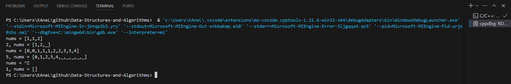
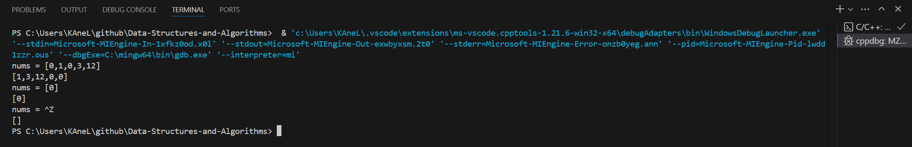
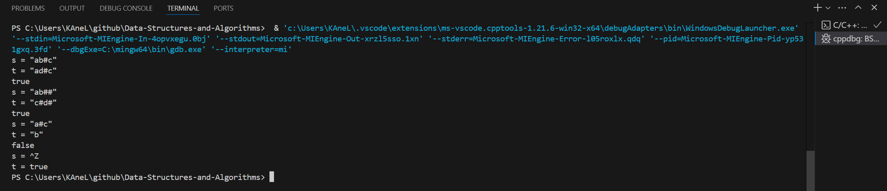
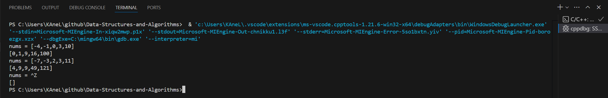
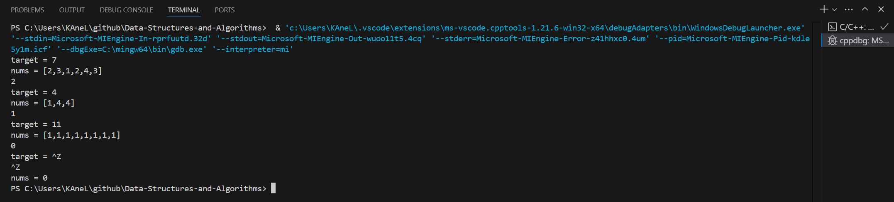
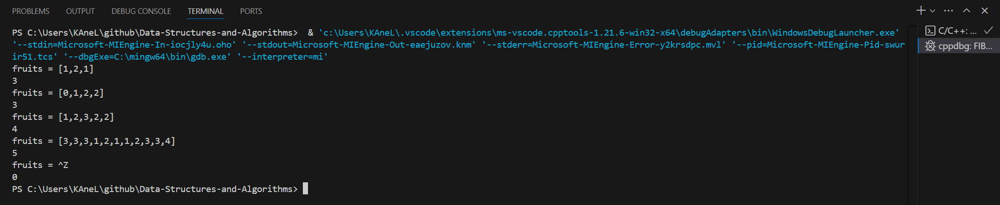

# Day2 content

[A. Remove Duplicates from Sorted Array](#a-remove-duplicates-from-sorted-array)

[B. Move Zeroes](#b-move-zeroes)

[C. Backspace String Compare](#c-backspace-string-compare)

[D. Squares of a Sorted Array](#d-squares-of-a-sorted-array)

[E. Minimum Size Subarray Sum](#e-minimum-size-subarray-sum)

[F. Fruit Into Baskets](#f-fruit-into-baskets)

[Review Time Table](#review-time-table)


## A. Remove Duplicates from Sorted Array

Given an integer array `nums` sorted in **non-decreasing order**, remove the duplicates ==in-place== such that each unique element appears only **once**. The **relative order** of the elements should be kept the **same**. Then return *the number of unique elements in `nums`*.

Consider the number of unique elements of `nums` to be `k`, to get accepted, you need to do the following things:

- Change the array `nums` such that the first `k` elements of `nums` contain the unique elements in the order they were present in `nums` initially. The remaining elements of `nums` are not important as well as the size of `nums`.
- Return k.

**Custom Judge:**

The judge will test your solution with the following code:

> int[] nums = [...]; // Input array
int[] expectedNums = [...]; // The expected answer with correct length
> 
int k = removeDuplicates(nums); // Calls your implementation
> 
assert k == expectedNums.length;
for (int i = 0; i < k; i++) {
    assert nums[i] == expectedNums[i];
}

If all assertions pass, then your solution will be accepted.


**Example 1:**

> **Input:** nums = [1,1,2]
**Output:** 2, nums = [1,2,_]
**Explanation:** Your function should return k = 2, with the first two elements of nums being 1 and 2 respectively.
It does not matter what you leave beyond the returned k (hence they are underscores).


**Example 2:**

> **Input:** nums = [0,0,1,1,1,2,2,3,3,4]
**Output:** 5, nums = [0,1,2,3,4,_,_,_,_,_]
**Explanation:** Your function should return k = 5, with the first five elements of nums being 0, 1, 2, 3, and 4 respectively.
It does not matter what you leave beyond the returned k (hence they are underscores).


**Constraints:**

- 1 <= nums.length <= 3 * $10^4$
- -100 <= nums[i] <= 100
- `nums` is sorted in **non-decreasing** order.

```c++
class Solution {
public:
    int removeDuplicates(vector<int>& nums) {
        
    }
};
```

[Solution](RDSA.cpp)



## B. Move Zeroes

Given an integer array `nums`, move all `0`'s to the end of it while maintaining the relative order of the non-zero elements.

**Note** that you must do this in-place without making a copy of the array.


**Example 1:**

> **Input:** nums = [0,1,0,3,12]
**Output:** [1,3,12,0,0]

**Example 2:**

> **Input:** nums = [0]
**Output:** [0]


**Constraints:**

- 1 <= nums.length <= $10^4$
- $-2^31$ <= nums[i] <= $2^31$ - 1


**Follow up:** Could you minimize the total number of operations done?

```c++
class Solution {
public:
    void moveZeroes(vector<int>& nums) {
        
    }
};
```

[Solution](MZ.cpp)



## C. Backspace String Compare

Given two strings `s` and `t`, return `true` *if they are equal when both are typed into empty text editors*. `'#'` means a backspace character.

Note that after backspacing an empty text, the text will continue empty.


**Example 1:**

> **Input:** s = "ab#c", t = "ad#c"
**Output:** true
**Explanation:** Both s and t become "ac".

**Example 2:**

> **Input:** s = "ab##", t = "c#d#"
**Output:** true
**Explanation:** Both s and t become "".

**Example 3:**

> **Input:** s = "a#c", t = "b"
**Output:** false
**Explanation:** s becomes "c" while t becomes "b".


**Constraints:**

- 1 <= s.length, t.length <= 200
- `s` and `t` only contain lowercase letters and `'#'` characters.


**Follow up:** Can you solve it in `O(n)` time and `O(1)` space?


```c++
class Solution {
public:
    bool backspaceCompare(string s, string t) {
        
    }
};
```


[Solution](BSC.cpp)




## D. Squares of a Sorted Array

Given an integer array `nums` sorted in **non-decreasing** order, return *an array of **the squares of each number** sorted in non-decreasing order*.

**Example 1:**

> **Input:** nums = [-4,-1,0,3,10]
**Output:** [0,1,9,16,100]
**Explanation:** After squaring, the array becomes [16,1,0,9,100].
After sorting, it becomes [0,1,9,16,100].

**Example 2:**

> **Input:** nums = [-7,-3,2,3,11]
**Output:** [4,9,9,49,121]


**Constraints:**

- 1 <= nums.length <= $10^4$
- $-10^4$ <= nums[i] <= $10^4$
- `nums` is sorted in **non-decreasing** order.


**Follow up:** Squaring each element and sorting the new array is very trivial, could you find an `O(n)` solution using a different approach?


```c++
class Solution {
public:
    vector<int> sortedSquares(vector<int>& nums) {
        
    }
};
```

[Solution](SSA.cpp)




## E. Minimum Size Subarray Sum

Given an array of positive integers `nums` and a positive integer `target`, return *the **minimal length** of a ==subarray== whose sum is greater than or equal to `target`*. If there is no such subarray, return `0` instead.


**Example 1:**

> **Input:** target = 7, nums = [2,3,1,2,4,3]
**Output:** 2
**Explanation:** The subarray [4,3] has the minimal length under the problem constraint.

**Example 2:**

> **Input:** target = 4, nums = [1,4,4]
**Output:** 1

**Example 3:**

> **Input:** target = 11, nums = [1,1,1,1,1,1,1,1]
**Output:** 0


**Constraints:**

- 1 <= target <= $10^9$
- 1 <= nums.length <= $10^5$
- 1 <= nums[i] <= $10^4$


**Follow up:** If you have figured out the `O(n)` solution, try coding another solution of which the time complexity is `O(n log(n))`.

```c++
class Solution {
public:
    int minSubArrayLen(int target, vector<int>& nums) {
        
    }
};
```

[Solution](MSSS.cpp)




## F. Fruit Into Baskets

You are visiting a farm that has a single row of fruit trees arranged from left to right. The trees are represented by an integer array `fruits` where `fruits[i]` is the **type** of fruit the ${i}^{th}$ tree produces.

You want to collect as much fruit as possible. However, the owner has some strict rules that you must follow:

- You only have **two** baskets, and each basket can only hold a ***single type*** of fruit. There is no limit on the amount of fruit each basket can hold.

- Starting from any tree of your choice, you must pick **exactly one fruit** from **every** tree (including the start tree) while moving to the right. The picked fruits must fit in one of your baskets.

- Once you reach a tree with fruit that cannot fit in your baskets, you must stop.

Given the integer array `fruits`, return *the ***maximum*** number of fruits you can pick*.


**Example 1:**

> **Input:** fruits = [1,2,1]
**Output:** 3
**Explanation:** We can pick from all 3 trees.

**Example 2:**

> **Input:** fruits = [0,1,2,2]
**Output:** 3
**Explanation:** We can pick from trees [1,2,2].
If we had started at the first tree, we would only pick from trees [0,1].

**Example 3:**

> **Input:** fruits = [1,2,3,2,2]
**Output:** 4
**Explanation:** We can pick from trees [2,3,2,2].
If we had started at the first tree, we would only pick from trees [1,2].


**Constraints:**

- 1 <= fruits.length <= $10^5$
- 0 <= fruits[i] < fruits.length

```c++
class Solution {
public:
    int totalFruit(vector<int>& fruits) {

    }
};
```

[Solution](FIB.cpp)




## Review Time Table

After N Days | Total(time) | A | B | C | D | E | F
1 | 01:21:21 | 00:05:18 | 00:04:27 | 00:28:31 | 00:08:17 | 00:08:53 | 00:25:55
2 | 00:53:43 | 00:06:55 | 00:03:41 | 00:17:25 | 00:06:36 | 00:05:26 | 00:13:40
7 | 00:28:39 | 00:01:38 | 00:02:33 | 00:05:49 | 00:04:36 | 00:04:35 | 00:09:28