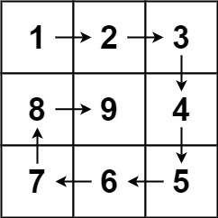
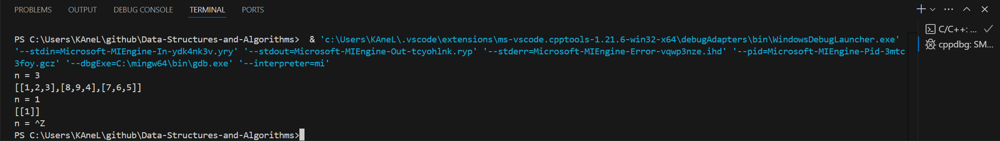
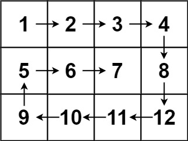

# Day3 content

[A. Minimum Window Substring](#a-minimum-window-substring)

[B. Spiral Matrix II](#b-spiral-matrix-ii)

[C. Spiral Matrix](#c-spiral-matrix)

[D. Spiral Through a Two-dimensional Array](#d-spiral-through-a-two-dimensional-array)

[E. Interval Sum](#e-interval-sum)

[F. Developer Purchasing Land](#f-developer-purchasing-land)

[Review Time Table](#review-time-table)


## A. Minimum Window Substring

Given two strings `s` and `t` of lengths `m` and `n` respectively, return *the **minimum window ==substring==** of `s` such that every character in `t` (**including duplicates**) is included in the window*. If there is no such substring, return the empty string `""`.
The testcases will be generated such that the answer is **unique**.


**Example 1:**

> **Input:** s = "ADOBECODEBANC", t = "ABC"
**Output:** "BANC"
**Explanation:** The minimum window substring "BANC" includes 'A', 'B', and 'C' from string t.

**Example 2:**

> **Input:** s = "a", t = "a"
**Output:** "a"
**Explanation:** The entire string s is the minimum window.

**Example 3:**

> **Input:** s = "a", t = "aa"
**Output:** ""
**Explanation:** Both 'a's from t must be included in the window.
Since the largest window of s only has one 'a', return empty string.


**Constraints:**

- m == s.length
- n == t.length
- 1 <= m, n <= $10^5$
- `s` and `t` consist of uppercase and lowercase English letters.


**Follow up:** Could you find an algorithm that runs in `O(m + n)` time?


```c++
class Solution {
public:
    string minWindow(string s, string t) {

    }
};
```

[Solution](MWS.cpp)


## B. Spiral Matrix II

Given a positive integer `n`, generate an `n x n` `matrix` filled with elements from `1` to $n^2$ in spiral order.


**Example 1:**



> **Input:** n = 3
**Output:** [[1,2,3],[8,9,4],[7,6,5]]

**Example 2:**

> **Input:** n = 1
**Output:** [[1]]


**Constraints:**

- 1 <= n <= 20


```c++
class Solution {
public:
    vector<vector<int>> generateMatrix(int n) {
        
    }
};
```

[Solution](SMII.cpp)




## C. Spiral Matrix

Given an `m x n` `matrix`, return *all elements of the `matrix` in spiral order*.


**Example 1:**


> **Input:** matrix = [[1,2,3],[4,5,6],[7,8,9]]
**Output:** [1,2,3,6,9,8,7,4,5]

**Example 2:**



> **Input:** matrix = [[1,2,3,4],[5,6,7,8],[9,10,11,12]]
**Output:** [1,2,3,4,8,12,11,10,9,5,6,7]


**Constraints:**

- m == matrix.length
- n == matrix[i].length
- 1 <= m, n <= 10
- -100 <= matrix[i][j] <= 100


```c++
class Solution {
public:
    vector<int> spiralOrder(vector<vector<int>>& matrix) {
        
    }
};
```

[Solution](SM.cpp)


## D. Spiral Through a Two-dimensional Array

Given a two-dimensional `array`, return the result of *spiraling through* the array.

**Spiral traversal**: Starting from the top left corner, the elements are extracted **one by one** in order of **right, down, left and up**, and then the same steps are repeated in the inner layer until all elements are extracted.

**Example 1:**

> **Input:** matrix = [[1,2,3],[8,9,4],[7,6,5]]
**Output:** [1,2,3,4,5,6,7,8,9]

**Example 2:**

> **Input:** matrix = [[1,2,3,4],[12,13,14,5],[11,16,15,6],[10,9,8,7]]
**Output:** [1,2,3,4,5,6,7,8,9,10,11,12,13,14,15,16]


**Constraints:**

- 0 <= array.length <= 100
- 0 <= array[i].length <= 100


```c++
class Solution {
public:
    vector<int> spiralArray(vector<vector<int>>& array) {

    }
};
```

[Solution](STTA.cpp)


## E. Interval Sum

Given an integer `array`, calculate the sum of the elements of the array in **each** specified range `[a,b]`.

**Example:**

> **Input:** array = [1,2,3,4,5]
			0 1
			1 3
**Output:** 3
				9


**Constraints:**

- 0 < array.size() <= $10^5$
- a >= 0, b >= a


[Solution](IS.cpp)


## F. Developer Purchasing Land

In a city area, it has been divided into `n * m` contiguous blocks, each with a different value representing the worth of the land. Currently, there are two development companies, Company A and Company B, that wish to purchase land in this city area.

Now, the goal is to allocate all the blocks in this city area to Company A and Company B.

However, due to urban planning restrictions, *the area can only be divided into two sub-areas either horizontally or vertically, and each sub-area must contain one or more blocks.* To ensure fair competition, you need to find an allocation method that **minimizes the difference** in the total land value between Company A and Company B's respective sub-areas.

**Note:** Blocks cannot be subdivided.

**Example:**

> **Input:** The first line contains two positive integers representing n and m. The following n lines each contain m positive integers.
3 3
1 2 3
2 1 3
1 2 3
**Output:** Please output a single integer that represents the minimum difference between the total land values of the two sub-areas.
0
**Explanation:** If the area is divided as follows:
1 2 | 3
2 1 | 3
1 2 | 3
The minimum difference in total land value between the two sub-areas can reach 0.


**Constraints:**

- 1 <= n, m <= 100;
- n and m are not both 1 at the same time.

[Solution](DPL.cpp)


## Review Time Table

After N Days | Total(time) | A | B | C | D | E | F
1 | 00:58:32 | 00:23:51 | 00:10:03 | 00:09:33 | 00:10:05 | 00:02:32 | 00:02:28