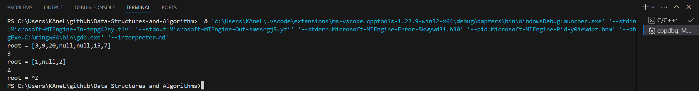

# Day10 content

[A. Binary Tree Level Order Traversal](#a-binary-tree-level-order-traversal)

[B. Binary Tree Level Order Traversal II](#b-binary-tree-level-order-traversal-ii)

[C. Binary Tree Right Side View](#c-binary-tree-right-side-view)

[D. Average of Levels in Binary Tree](#d-average-of-levels-in-binary-tree)

[E. N-ary Tree Level Order Traversal](#e-n-ary-tree-level-order-traversal)

[F. Find Largest Value in Each Tree Row](#f-find-largest-value-in-each-tree-row)

[G. Populating Next Right Pointers in Each Node](#g-populating-next-right-pointers-in-each-node)

[H. Populating Next Right Pointers in Each Node II](#h-populating-next-right-pointers-in-each-node-ii)

[I. Maximum Depth of Binary Tree](#i-maximum-depth-of-binary-tree)

[J. Minimum Depth of Binary Tree](#j-minimum-depth-of-binary-tree)

[Review Time Table](#review-time-table)


## A. Binary Tree Level Order Traversal

Given the `root` of a binary tree, return *the level order traversal of its nodes' values*. (i.e., from left to right, level by level).

 
**Example 1:**


> **Input:** root = [3,9,20,null,null,15,7]
**Output:** [[3],[9,20],[15,7]]


**Example 2:**

> **Input:** root = [1]
**Output:** [[1]]

**Example 3:**

> **Input:** root = []
**Output:** []
 

**Constraints:**

- The number of nodes in the tree is in the range `[0, 2000]`.
- -1000 <= Node.val <= 1000


```c++
/**
 * Definition for a binary tree node.
 * struct TreeNode {
 *     int val;
 *     TreeNode *left;
 *     TreeNode *right;
 *     TreeNode() : val(0), left(nullptr), right(nullptr) {}
 *     TreeNode(int x) : val(x), left(nullptr), right(nullptr) {}
 *     TreeNode(int x, TreeNode *left, TreeNode *right) : val(x), left(left), right(right) {}
 * };
 */
class Solution {
public:
    vector<vector<int>> levelOrder(TreeNode* root) {
        
    }
};
```

[Solution](BTLOT.cpp)


## B. Binary Tree Level Order Traversal II

Given the `root` of a binary tree, return *the bottom-up level order traversal of its nodes' values*. (i.e., from left to right, level by level from leaf to root).

 
**Example 1:**


> **Input:** root = [3,9,20,null,null,15,7]
**Output:** [[15,7],[9,20],[3]]

**Example 2:**

> **Input:** root = [1]
**Output:** [[1]]

**Example 3:**

> **Input:** root = []
**Output:** []
 

**Constraints:**

- The number of nodes in the tree is in the range `[0, 2000]`.
- -1000 <= Node.val <= 1000


```c++
/**
 * Definition for a binary tree node.
 * struct TreeNode {
 *     int val;
 *     TreeNode *left;
 *     TreeNode *right;
 *     TreeNode() : val(0), left(nullptr), right(nullptr) {}
 *     TreeNode(int x) : val(x), left(nullptr), right(nullptr) {}
 *     TreeNode(int x, TreeNode *left, TreeNode *right) : val(x), left(left), right(right) {}
 * };
 */
class Solution {
public:
    vector<vector<int>> levelOrderBottom(TreeNode* root) {
        
    }
};
```

[Solution](BTLOTII.cpp)


## C. Binary Tree Right Side View

Given the `root` of a binary tree, imagine yourself standing on the **right side** of it, return *the values of the nodes you can see ordered from top to bottom*.

 
**Example 1:**


> **Input:** root = [1,2,3,null,5,null,4]
**Output:** [1,3,4]

**Example 2:**

> **Input:** root = [1,null,3]
**Output:** [1,3]

**Example 3:**

> **Input:** root = []
**Output:** []
 

**Constraints:**

- The number of nodes in the tree is in the range `[0, 100]`.
- -100 <= Node.val <= 100


```c++
/**
 * Definition for a binary tree node.
 * struct TreeNode {
 *     int val;
 *     TreeNode *left;
 *     TreeNode *right;
 *     TreeNode() : val(0), left(nullptr), right(nullptr) {}
 *     TreeNode(int x) : val(x), left(nullptr), right(nullptr) {}
 *     TreeNode(int x, TreeNode *left, TreeNode *right) : val(x), left(left), right(right) {}
 * };
 */
class Solution {
public:
    vector<int> rightSideView(TreeNode* root) {
        
    }
};
```

[Solution](BTRSV.cpp)


## D. Average of Levels in Binary Tree

Given the `root` of a binary tree, return *the average value of the nodes on each level in the form of an array*. Answers within $10^-5$ of the actual answer will be accepted.
 

**Example 1:**


> **Input:** root = [3,9,20,null,null,15,7]
**Output:** [3.00000,14.50000,11.00000]
**Explanation:** The average value of nodes on level 0 is 3, on level 1 is 14.5, and on level 2 is 11.
Hence return [3, 14.5, 11].

**Example 2:**


> **Input:** root = [3,9,20,15,7]
**Output:** [3.00000,14.50000,11.00000]
 

**Constraints:**

- The number of nodes in the tree is in the range [1, $10^4$].
- $-2^31$ <= Node.val <= $2^31$ - 1


```c++
/**
 * Definition for a binary tree node.
 * struct TreeNode {
 *     int val;
 *     TreeNode *left;
 *     TreeNode *right;
 *     TreeNode() : val(0), left(nullptr), right(nullptr) {}
 *     TreeNode(int x) : val(x), left(nullptr), right(nullptr) {}
 *     TreeNode(int x, TreeNode *left, TreeNode *right) : val(x), left(left), right(right) {}
 * };
 */
class Solution {
public:
    vector<double> averageOfLevels(TreeNode* root) {
        
    }
};
```

[Solution](ALBT.cpp)


## E. N-ary Tree Level Order Traversal

Given an n-ary tree, return the level order traversal of its nodes' values.

*Nary-Tree input serialization is represented in their level order traversal, each group of children is separated by the null value (See examples).*

 
**Example 1:**


> **Input:** root = [1,null,3,2,4,null,5,6]
**Output:** [[1],[3,2,4],[5,6]]

**Example 2:**


> **Input:** root = [1,null,2,3,4,5,null,null,6,7,null,8,null,9,10,null,null,11,null,12,null,13,null,null,14]
**Output:** [[1],[2,3,4,5],[6,7,8,9,10],[11,12,13],[14]]
 

**Constraints:**

- The height of the n-ary tree is less than or equal to `1000`
- The total number of nodes is between [0, $10^4$]


```c++
/*
// Definition for a Node.
class Node {
public:
    int val;
    vector<Node*> children;

    Node() {}

    Node(int _val) {
        val = _val;
    }

    Node(int _val, vector<Node*> _children) {
        val = _val;
        children = _children;
    }
};
*/

class Solution {
public:
    vector<vector<int>> levelOrder(Node* root) {
        
    }
};
```

[Solution](NTLOT.cpp)


## F. Find Largest Value in Each Tree Row

Given the `root` of a binary tree, return *an array of the largest value in each row* of the tree **(0-indexed)**.

 
**Example 1:**


> **Input:** root = [1,3,2,5,3,null,9]
**Output:** [1,3,9]

**Example 2:**

> **Input:** root = [1,2,3]
**Output:** [1,3]
 

**Constraints:**

- The number of nodes in the tree will be in the range [0, $10^4$].
- $-2^31$ <= Node.val <= $2^31$ - 1


```c++
/**
 * Definition for a binary tree node.
 * struct TreeNode {
 *     int val;
 *     TreeNode *left;
 *     TreeNode *right;
 *     TreeNode() : val(0), left(nullptr), right(nullptr) {}
 *     TreeNode(int x) : val(x), left(nullptr), right(nullptr) {}
 *     TreeNode(int x, TreeNode *left, TreeNode *right) : val(x), left(left), right(right) {}
 * };
 */
class Solution {
public:
    vector<int> largestValues(TreeNode* root) {
        
    }
};
```

[Solution](FLVETR.cpp)


## G. Populating Next Right Pointers in Each Node

You are given a **perfect binary tree** where all leaves are on the same level, and every parent has two children. The binary tree has the following definition:

    struct Node {
        int val;
        Node *left;
        Node *right;
        Node *next;
    }

Populate each next pointer to point to its next right node. If there is no next right node, the next pointer should be set to `NULL`.

Initially, all next pointers are set to `NULL`.

 
**Example 1:**


> **Input:** root = [1,2,3,4,5,6,7]
**Output:** [1,#,2,3,#,4,5,6,7,#]
**Explanation:** Given the above perfect binary tree (Figure A), your function should populate each next pointer to point to its next right node, just like in Figure B. The serialized output is in level order as connected by the next pointers, with '#' signifying the end of each level.

**Example 2:**

> **Input:** root = []
**Output:** []
 

**Constraints:**

- The number of nodes in the tree is in the range [0, $2^12$ - 1].
- -1000 <= Node.val <= 1000
 

**Follow-up:**
- You may only use constant extra space.
- The recursive approach is fine. You may assume implicit stack space does not count as extra space for this problem.


```c++
/*
// Definition for a Node.
class Node {
public:
    int val;
    Node* left;
    Node* right;
    Node* next;

    Node() : val(0), left(NULL), right(NULL), next(NULL) {}

    Node(int _val) : val(_val), left(NULL), right(NULL), next(NULL) {}

    Node(int _val, Node* _left, Node* _right, Node* _next)
        : val(_val), left(_left), right(_right), next(_next) {}
};
*/

class Solution {
public:
    Node* connect(Node* root) {
        
    }
};
```

[Solution](PNRPEN.cpp)


## H. Populating Next Right Pointers in Each Node II

Given a binary tree

    struct Node {
        int val;
        Node *left;
        Node *right;
        Node *next;
    }

Populate each next pointer to point to its next right node. If there is no next right node, the next pointer should be set to `NULL`.

Initially, all next pointers are set to `NULL`.

 
**Example 1:**


> **Input:** root = [1,2,3,4,5,null,7]
**Output:** [1,#,2,3,#,4,5,7,#]
**Explanation:** Given the above binary tree (Figure A), your function should populate each next pointer to point to its next right node, just like in Figure B. The serialized output is in level order as connected by the next pointers, with '#' signifying the end of each level.

**Example 2:**

> **Input:** root = []
**Output:** []
 

**Constraints:**

- The number of nodes in the tree is in the range `[0, 6000]`.
- -100 <= Node.val <= 100
 

**Follow-up:**

- You may only use constant extra space.
- The recursive approach is fine. You may assume implicit stack space does not count as extra space for this problem.


```c++
/*
// Definition for a Node.
class Node {
public:
    int val;
    Node* left;
    Node* right;
    Node* next;

    Node() : val(0), left(NULL), right(NULL), next(NULL) {}

    Node(int _val) : val(_val), left(NULL), right(NULL), next(NULL) {}

    Node(int _val, Node* _left, Node* _right, Node* _next)
        : val(_val), left(_left), right(_right), next(_next) {}
};
*/

class Solution {
public:
    Node* connect(Node* root) {
        
    }
};
```

[Solution](PNRPENII.cpp)


## I. Maximum Depth of Binary Tree

Given the `root` of a binary tree, return *its maximum depth*.

A binary tree's **maximum depth** is the number of nodes along the longest path from the root node down to the farthest leaf node.

 
**Example 1:**


> **Input:** root = [3,9,20,null,null,15,7]
**Output:** 3

**Example 2:**

> **Input:** root = [1,null,2]
**Output:** 2
 

**Constraints:**

- The number of nodes in the tree is in the range [0, $10^4$].
- -100 <= Node.val <= 100


```c++
/**
 * Definition for a binary tree node.
 * struct TreeNode {
 *     int val;
 *     TreeNode *left;
 *     TreeNode *right;
 *     TreeNode() : val(0), left(nullptr), right(nullptr) {}
 *     TreeNode(int x) : val(x), left(nullptr), right(nullptr) {}
 *     TreeNode(int x, TreeNode *left, TreeNode *right) : val(x), left(left), right(right) {}
 * };
 */
class Solution {
public:
    int maxDepth(TreeNode* root) {
        
    }
};
```

[Solution](MaxDBT.cpp)




## J. Minimum Depth of Binary Tree

Given a binary tree, find its minimum depth.

The minimum depth is the number of nodes along the shortest path from the root node down to the nearest leaf node.

Note: A leaf is a node with no children.

 
Example 1:


> **Input:** root = [3,9,20,null,null,15,7]
**Output:** 2

**Example 2:**

> **Input:** root = [2,null,3,null,4,null,5,null,6]
**Output:** 5
 

**Constraints:**

- The number of nodes in the tree is in the range [0, $10^5$].
- -100 <= Node.val <= 100


```c++
/**
 * Definition for a binary tree node.
 * struct TreeNode {
 *     int val;
 *     TreeNode *left;
 *     TreeNode *right;
 *     TreeNode() : val(0), left(nullptr), right(nullptr) {}
 *     TreeNode(int x) : val(x), left(nullptr), right(nullptr) {}
 *     TreeNode(int x, TreeNode *left, TreeNode *right) : val(x), left(left), right(right) {}
 * };
 */
class Solution {
public:
    int minDepth(TreeNode* root) {
        
    }
};
```

[Solution](MinDBT.cpp)


## Review Time Table

After N Days | Total(time) | A | B | C | D | E | F | G | H | I | J
1 | 00:38:35 | 00:03:09 | 00:02:52 | 00:04:35 | 00:04:12 | 00:03:42 | 00:03:16 | 00:08:04 | 00:03:28 | 00:02:19 | 00:02:58
2 | 00:39:45 | 00:02:50 | 00:03:31 | 00:05:06 | 00:08:22 | 00:04:47 | 00:03:01 | 00:05:09 | 00:02:26 | 00:02:11 | 00:02:22