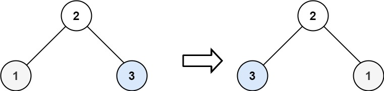
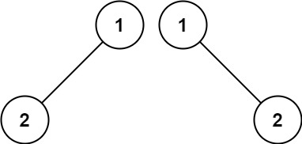
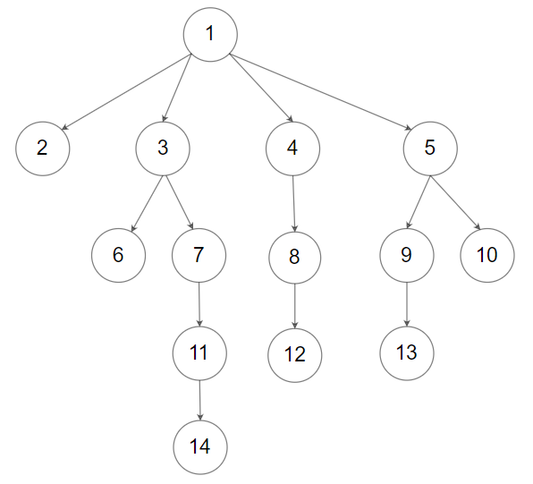

# Day11 content

[A. Invert Binary Tree](#a-invert-binary-tree)

[B. Symmetric Tree](#b-symmetric-tree)

[C. Same Tree](#c-same-tree)

[D. Subtree of Another Tree](#d-subtree-of-another-tree)

[E. Maximum Depth of Binary Tree -- Recursion](#e-maximum-depth-of-binary-tree----recursion)

[F. Maximum Depth of N-ary Tree](#f-maximum-depth-of-n-ary-tree)

[Review Time Table](#review-time-table)


## A. Invert Binary Tree


Given the `root` of a binary tree, invert the tree, and return *its root*.

 
**Example 1:**


> **Input:** root = [4,2,7,1,3,6,9]
**Output:** [4,7,2,9,6,3,1]

**Example 2:**



> **Input:** root = [2,1,3]
**Output:** [2,3,1]

**Example 3:**

> **Input:** root = []
**Output:** []
 

**Constraints:**

- The number of nodes in the tree is in the range `[0, 100]`.
- -100 <= Node.val <= 100


```c++
/**
 * Definition for a binary tree node.
 * struct TreeNode {
 *     int val;
 *     TreeNode *left;
 *     TreeNode *right;
 *     TreeNode() : val(0), left(nullptr), right(nullptr) {}
 *     TreeNode(int x) : val(x), left(nullptr), right(nullptr) {}
 *     TreeNode(int x, TreeNode *left, TreeNode *right) : val(x), left(left), right(right) {}
 * };
 */
class Solution {
public:
    TreeNode* invertTree(TreeNode* root) {
        
    }
};
```

[Solution](IBT.cpp)


## B. Symmetric Tree

Given the `root` of a binary tree, *check whether it is a mirror of itself* (i.e., symmetric around its center).

 
**Example 1:**


> **Input:** root = [1,2,2,3,4,4,3]
**Output:** true

**Example 2:**


> **Input:** root = [1,2,2,null,3,null,3]
**Output:** false
 

**Constraints:**

- The number of nodes in the tree is in the range `[1, 1000]`.
- -100 <= Node.val <= 100
 

**Follow up:** Could you solve it both recursively and iteratively?


```c++
/**
 * Definition for a binary tree node.
 * struct TreeNode {
 *     int val;
 *     TreeNode *left;
 *     TreeNode *right;
 *     TreeNode() : val(0), left(nullptr), right(nullptr) {}
 *     TreeNode(int x) : val(x), left(nullptr), right(nullptr) {}
 *     TreeNode(int x, TreeNode *left, TreeNode *right) : val(x), left(left), right(right) {}
 * };
 */
class Solution {
public:
    bool isSymmetric(TreeNode* root) {
        
    }
};
```


[Solution_Recursive](ST_R.cpp)

[Solution_Iterative](ST_I.cpp)


## C. Same Tree

Given the roots of two binary trees `p` and `q`, write a function to check if they are the same or not.

Two binary trees are considered the same if they are structurally identical, and the nodes have the same value.

 
**Example 1:**


> **Input:** p = [1,2,3], q = [1,2,3]
**Output:** true

**Example 2:**



> **Input:** p = [1,2], q = [1,null,2]
**Output:** false

**Example 3:**


> **Input:** p = [1,2,1], q = [1,1,2]
**Output:** false
 

**Constraints:**

- The number of nodes in both trees is in the range `[0, 100]`.
- $-10^4$ <= Node.val <= $10^4$


```c++
/**
 * Definition for a binary tree node.
 * struct TreeNode {
 *     int val;
 *     TreeNode *left;
 *     TreeNode *right;
 *     TreeNode() : val(0), left(nullptr), right(nullptr) {}
 *     TreeNode(int x) : val(x), left(nullptr), right(nullptr) {}
 *     TreeNode(int x, TreeNode *left, TreeNode *right) : val(x), left(left), right(right) {}
 * };
 */
class Solution {
public:
    bool isSameTree(TreeNode* p, TreeNode* q) {
        
    }
};
```

[Solution](ST.cpp)


## D. Subtree of Another Tree

Given the roots of two binary trees `root` and `subRoot`, return `true` if there is a subtree of `root` with the same structure and node values of `subRoot` and `false` otherwise.

A subtree of a binary tree `tree` is a tree that consists of a node in `tree` and all of this node's descendants. The tree `tree` could also be considered as a subtree of itself.

 
**Example 1:**


> **Input:** root = [3,4,5,1,2], subRoot = [4,1,2]
**Output:** true

**Example 2:**


> **Input:** root = [3,4,5,1,2,null,null,null,null,0], subRoot = [4,1,2]
**Output:** false
 

**Constraints:**

- The number of nodes in the `root` tree is in the range `[1, 2000]`.
- The number of nodes in the `subRoot` tree is in the range `[1, 1000]`.
- $-10^4$ <= root.val <= $10^4$
- $-10^4$ <= subRoot.val <= $10^4$


```c++
/**
 * Definition for a binary tree node.
 * struct TreeNode {
 *     int val;
 *     TreeNode *left;
 *     TreeNode *right;
 *     TreeNode() : val(0), left(nullptr), right(nullptr) {}
 *     TreeNode(int x) : val(x), left(nullptr), right(nullptr) {}
 *     TreeNode(int x, TreeNode *left, TreeNode *right) : val(x), left(left), right(right) {}
 * };
 */
class Solution {
public:
    bool isSubtree(TreeNode* root, TreeNode* subRoot) {
        
    }
};
```

[Solution](SAT.cpp)


## E. Maximum Depth of Binary Tree -- Recursion

[Problem & Iterative Solution](./Day10.md/#i-maximum-depth-of-binary-tree)

[Solution_Recursive](MaxDBT_R.cpp)


## F. Maximum Depth of N-ary Tree

Given a n-ary tree, find its maximum depth.

The maximum depth is the number of nodes along the longest path from the root node down to the farthest leaf node.

*Nary-Tree input serialization is represented in their level order traversal, each group of children is separated by the null value (See examples).*

 
**Example 1:**


> **Input:** root = [1,null,3,2,4,null,5,6]
**Output:** 3

**Example 2:**



> **Input:** root = [1,null,2,3,4,5,null,null,6,7,null,8,null,9,10,null,null,11,null,12,null,13,null,null,14]
**Output:** 5
 

**Constraints:**

- The total number of nodes is in the range [0, $10^4$].
- The depth of the n-ary tree is less than or equal to `1000`.


```c++
/*
// Definition for a Node.
class Node {
public:
    int val;
    vector<Node*> children;

    Node() {}

    Node(int _val) {
        val = _val;
    }

    Node(int _val, vector<Node*> _children) {
        val = _val;
        children = _children;
    }
};
*/

class Solution {
public:
    int maxDepth(Node* root) {
        
    }
};
```

[Solution](MDNT.cpp)


## Review Time Table

After N Days | Total(time) | A | B | C | D | E | F
1 | 01:31:17 | 00:08:15 | 00:08:41 | 00:02:41 | 00:06:19 | 00:02:33 | 00:10:59