# Day12 content

[A. Minimum Depth of Binary Tree -- Recursive](#a-minimum-depth-of-binary-tree----recursive)

[B. Count Complete Tree Nodes](#b-count-complete-tree-nodes)

[C. Balanced Binary Tree](#c-balanced-binary-tree)

[D. Binary Tree Paths](#d-binary-tree-paths)

[E. Sum of Left Leaves](#e-sum-of-left-leaves)

[F. Find Bottom Left Tree Value](#f-find-bottom-left-tree-value)


## A. Minimum Depth of Binary Tree -- Recursive

[Problem & Iterative Solution](./Day10.md/#j-minimum-depth-of-binary-tree)

[Solution_Recursive](MinDBT_R.cpp)

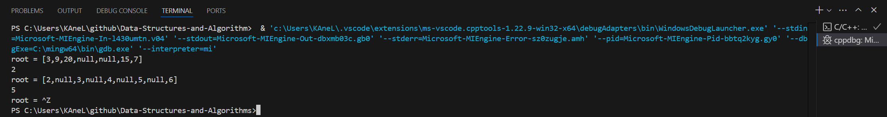


## B. Count Complete Tree Nodes

Given the `root` of a **complete** binary tree, return the number of the nodes in the tree.

According to [Wikipedia](http://en.wikipedia.org/wiki/Binary_tree#Types_of_binary_trees), every level, except possibly the last, is completely filled in a complete binary tree, and all nodes in the last level are as far left as possible. It can have between `1` and ${2}^{h}$ nodes inclusive at the last level `h`.

Design an algorithm that runs in less than `O(n)` time complexity.

 
**Example 1:**

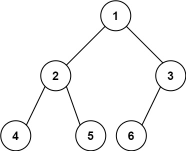

> **Input:** root = [1,2,3,4,5,6]
**Output:** 6

**Example 2:**

> **Input:** root = []
**Output:** 0

**Example 3:**

> **Input:** root = [1]
**Output:** 1
 

**Constraints:**

- The number of nodes in the tree is in the range [0, 5 * $10^4$].
- 0 <= Node.val <= 5 * $10^4$
- The tree is guaranteed to be **complete**.


```c++
/**
 * Definition for a binary tree node.
 * struct TreeNode {
 *     int val;
 *     TreeNode *left;
 *     TreeNode *right;
 *     TreeNode() : val(0), left(nullptr), right(nullptr) {}
 *     TreeNode(int x) : val(x), left(nullptr), right(nullptr) {}
 *     TreeNode(int x, TreeNode *left, TreeNode *right) : val(x), left(left), right(right) {}
 * };
 */
class Solution {
public:
    int countNodes(TreeNode* root) {
        
    }
};
```

[Solution_Common_Recursive](CCTN_R.cpp)

[Solution_Common_Iterative](CCTN_I.cpp)

[Solution_Complete_function](CCTN.cpp)

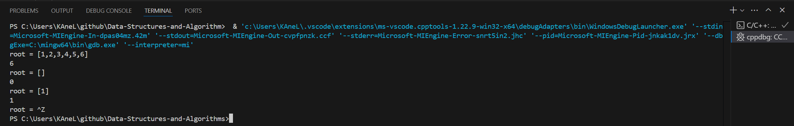


## C. Balanced Binary Tree

Given a binary tree, determine if it is ==height-balanced==.

A height-balanced binary tree is a binary tree in which the depth of the two subtrees of every node never differs by more than one.

**Example 1:**

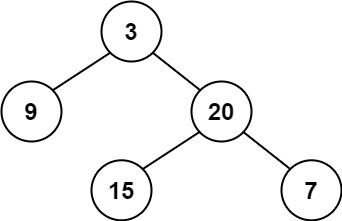

> **Input:** root = [3,9,20,null,null,15,7]
**Output:** true

**Example 2:**

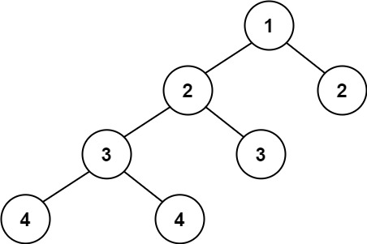

> **Input:** root = [1,2,2,3,3,null,null,4,4]
**Output:** false

**Example 3:**

> **Input:** root = []
**Output:** true
 

**Constraints:**

- The number of nodes in the tree is in the range `[0, 5000]`.
- $-10^4$ <= Node.val <= $10^4$


```c++
/**
 * Definition for a binary tree node.
 * struct TreeNode {
 *     int val;
 *     TreeNode *left;
 *     TreeNode *right;
 *     TreeNode() : val(0), left(nullptr), right(nullptr) {}
 *     TreeNode(int x) : val(x), left(nullptr), right(nullptr) {}
 *     TreeNode(int x, TreeNode *left, TreeNode *right) : val(x), left(left), right(right) {}
 * };
 */
class Solution {
public:
    bool isBalanced(TreeNode* root) {
        
    }
};
```

[Solution](BBT.cpp)

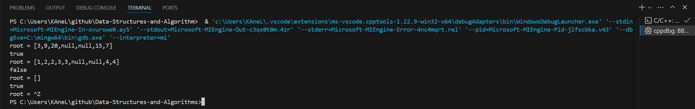


## D. Binary Tree Paths

Given the `root` of a binary tree, return *all root-to-leaf paths in **any order***.

A **leaf** is a node with no children.

 
**Example 1:**

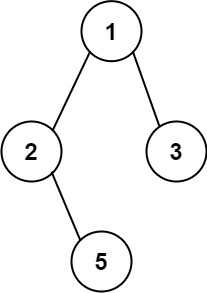

> **Input:** root = [1,2,3,null,5]
**Output:** ["1->2->5","1->3"]

**Example 2:**

> **Input:** root = [1]
**Output:** ["1"]
 

**Constraints:**

- The number of nodes in the tree is in the range `[1, 100]`.
- -100 <= Node.val <= 100


```c++
/**
 * Definition for a binary tree node.
 * struct TreeNode {
 *     int val;
 *     TreeNode *left;
 *     TreeNode *right;
 *     TreeNode() : val(0), left(nullptr), right(nullptr) {}
 *     TreeNode(int x) : val(x), left(nullptr), right(nullptr) {}
 *     TreeNode(int x, TreeNode *left, TreeNode *right) : val(x), left(left), right(right) {}
 * };
 */
class Solution {
public:
    vector<string> binaryTreePaths(TreeNode* root) {
        
    }
};
```

[Solution_Recursive](BTP_R.cpp)

[Solution_Iterative](BTP_I.cpp)

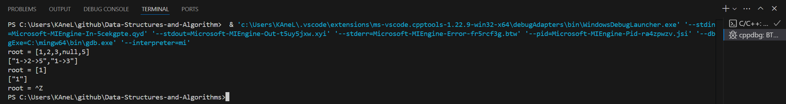


## E. Sum of Left Leaves

Given the ro`ot of a binary tree, return *the sum of all left leaves*.

A **leaf** is a node with no children. A **left leaf** is a leaf that is the left child of another node.

 
**Example 1:**


> **Input:** root = [3,9,20,null,null,15,7]
**Output:** 24
**Explanation:** There are two left leaves in the binary tree, with values 9 and 15 respectively.

**Example 2:**

> **Input:** root = [1]
**Output:** 0
 

**Constraints:**

- The number of nodes in the tree is in the range `[1, 1000]`.
- -1000 <= Node.val <= 1000


```c++
/**
 * Definition for a binary tree node.
 * struct TreeNode {
 *     int val;
 *     TreeNode *left;
 *     TreeNode *right;
 *     TreeNode() : val(0), left(nullptr), right(nullptr) {}
 *     TreeNode(int x) : val(x), left(nullptr), right(nullptr) {}
 *     TreeNode(int x, TreeNode *left, TreeNode *right) : val(x), left(left), right(right) {}
 * };
 */
class Solution {
public:
    int sumOfLeftLeaves(TreeNode* root) {
        
    }
};
```

[Solution_Recursive](SLL_R.cpp)

[Solution_Iterative](SLL_I.cpp)

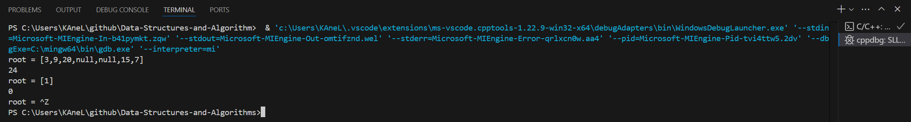


## F. Find Bottom Left Tree Value

Given the `root` of a binary tree, return the leftmost value in the last row of the tree.

 
**Example 1:**

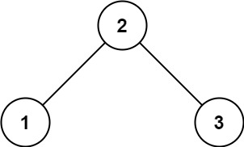

> **Input:** root = [2,1,3]
**Output:** 1

**Example 2:**

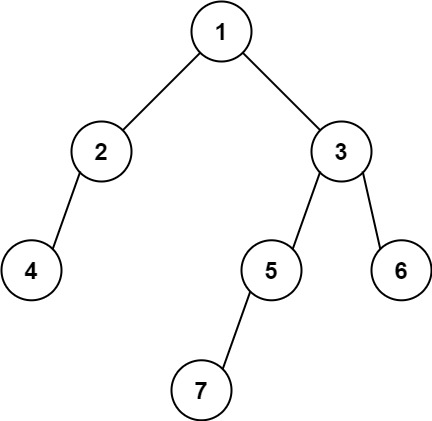

> **Input:** root = [1,2,3,4,null,5,6,null,null,7]
**Output:** 7
 

**Constraints:**

- The number of nodes in the tree is in the range [1, $10^4$].
- $-2^31$ <= Node.val <= $2^31$ - 1


```c++
/**
 * Definition for a binary tree node.
 * struct TreeNode {
 *     int val;
 *     TreeNode *left;
 *     TreeNode *right;
 *     TreeNode() : val(0), left(nullptr), right(nullptr) {}
 *     TreeNode(int x) : val(x), left(nullptr), right(nullptr) {}
 *     TreeNode(int x, TreeNode *left, TreeNode *right) : val(x), left(left), right(right) {}
 * };
 */
class Solution {
public:
    int findBottomLeftValue(TreeNode* root) {
        
    }
};
```

[Solution_Recursive](FBLTV_R.cpp)

[Solution_Iterative](FBLTV_I.cpp)

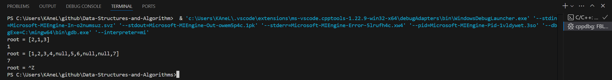


