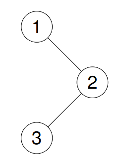

# Day9 content

[A. Sliding Window Maximum](#a-sliding-window-maximum)

[B. Top K Frequent Elements](#b-top-k-frequent-elements)

[C. Binary Tree Preorder Traversal](#c-binary-tree-preorder-traversal)

[D. Binary Tree Postorder Traversal](#d-binary-tree-postorder-traversal)

[E. Binary Tree Inorder Traversal](#e-binary-tree-inorder-traversal)

[Review Time Table](#review-time-table)


## A. Sliding Window Maximum

You are given an array of integers `nums`, there is a sliding window of size `k` which is moving from the very left of the array to the very right. You can only see the `k` numbers in the window. Each time the sliding window moves right by one position.

Return the max sliding window.


**Example 1:**

> **Input:** nums = [1,3,-1,-3,5,3,6,7], k = 3
**Output:** [3,3,5,5,6,7]
**Explanation:** 
Window position                Max
---------------               -----
[1  3  -1] -3  5  3  6  7     **3**
 1 [3  -1  -3] 5  3  6  7     **3**
 1  3 [-1  -3  5] 3  6  7     **5**
 1  3  -1 [-3  5  3] 6  7     **5**
 1  3  -1  -3 [5  3  6] 7     **6**
 1  3  -1  -3  5 [3  6  7]    **7**

**Example 2:**

> **Input:** nums = [1], k = 1
**Output:** [1]
 

**Constraints:**

- 1 <= nums.length <= $10^5$
- $-10^4$ <= nums[i] <= $10^4$
- 1 <= k <= nums.length


```c++
class Solution {
public:
    vector<int> maxSlidingWindow(vector<int>& nums, int k) {
        
    }
};
```

[Solution](../Stacks_Queues/SWM.cpp)


## B. Top K Frequent Elements

Given an integer array `nums` and an integer `k`, return *the `k` most frequent elements*. You may return the answer in **any order**.


**Example 1:**

> **Input:** nums = [1,1,1,2,2,3], k = 2
**Output:** [1,2]

**Example 2:**

> **Input:** nums = [1], k = 1
**Output:** [1]
 

**Constraints:**

- 1 <= nums.length <= $10^5$
- $-10^4$ <= nums[i] <= $10^4$
- `k` is in the range `[1, the number of unique elements in the array]`.
- It is **guaranteed** that the answer is **unique**.
 

**Follow up:** Your algorithm's time complexity must be better than `O(n log n)`, where n is the array's size.


```c++
class Solution {
public:
    vector<int> topKFrequent(vector<int>& nums, int k) {
        
    }
};
```

[Solution](../Stacks_Queues/TKFE.cpp)


## C. Binary Tree Preorder Traversal

Given the `root` of a binary tree, return *the preorder traversal of its nodes' values*.

 
**Example 1:**

> **Input:** root = [1,null,2,3]
**Output:** [1,2,3]
**Explanation:**


**Example 2:**

> **Input:** root = [1,2,3,4,5,null,8,null,null,6,7,9]
**Output:** [1,2,4,5,6,7,3,8,9]
Explanation:


**Example 3:**

> **Input:** root = []
**Output:** []

**Example 4:**

> **Input:** root = [1]
**Output:** [1]

 
**Constraints:**

- The number of nodes in the tree is in the range `[0, 100]`.
- -100 <= Node.val <= 100
 

**Follow up:** Recursive solution is trivial, could you do it iteratively?


```c++
/**
 * Definition for a binary tree node.
 * struct TreeNode {
 *     int val;
 *     TreeNode *left;
 *     TreeNode *right;
 *     TreeNode() : val(0), left(nullptr), right(nullptr) {}
 *     TreeNode(int x) : val(x), left(nullptr), right(nullptr) {}
 *     TreeNode(int x, TreeNode *left, TreeNode *right) : val(x), left(left), right(right) {}
 * };
 */
class Solution {
public:
    vector<int> preorderTraversal(TreeNode* root) {
        
    }
};
```

[Solution_Recursive](BTPreT_R.cpp)


[Solution_Iterative](BTPreT_I.cpp)


## D. Binary Tree Postorder Traversal

Given the `root` of a binary tree, return *the postorder traversal of its nodes' values*.

 
**Example 1:**

> **Input:** root = [1,null,2,3]
**Output:** [3,2,1]
**Explanation:**


**Example 2:**

> **Input:** root = [1,2,3,4,5,null,8,null,null,6,7,9]
**Output:** [4,6,7,5,2,9,8,3,1]
**Explanation:**


**Example 3:**

> **Input:** root = []
**Output:** []

**Example 4:**

> **Input:** root = [1]
**Output:** [1]

 
**Constraints:**

- The number of the nodes in the tree is in the range `[0, 100]`.
- -100 <= Node.val <= 100
 

**Follow up:** Recursive solution is trivial, could you do it iteratively?


```c++
/**
 * Definition for a binary tree node.
 * struct TreeNode {
 *     int val;
 *     TreeNode *left;
 *     TreeNode *right;
 *     TreeNode() : val(0), left(nullptr), right(nullptr) {}
 *     TreeNode(int x) : val(x), left(nullptr), right(nullptr) {}
 *     TreeNode(int x, TreeNode *left, TreeNode *right) : val(x), left(left), right(right) {}
 * };
 */
class Solution {
public:
    vector<int> postorderTraversal(TreeNode* root) {
        
    }
};
```

[Solution_Recursive](BTPosT_R.cpp)


[Solution_Iterative](BTPosT_I.cpp)


## E. Binary Tree Inorder Traversal

Given the `root` of a binary tree, return *the inorder traversal of its nodes' values*.

 
**Example 1:**

> **Input:** root = [1,null,2,3]
**Output:** [1,3,2]
**Explanation:**


**Example 2:**

> **Input:** root = [1,2,3,4,5,null,8,null,null,6,7,9]
**Output:** [4,2,6,5,7,1,3,9,8]
**Explanation:**


**Example 3:**

> **Input:** root = []
**Output:** []

**Example 4:**

> **Input:** root = [1]
**Output:** [1]

 
**Constraints:**

- The number of nodes in the tree is in the range `[0, 100]`.
- -100 <= Node.val <= 100
 

**Follow up:** Recursive solution is trivial, could you do it iteratively?


```c++
/**
 * Definition for a binary tree node.
 * struct TreeNode {
 *     int val;
 *     TreeNode *left;
 *     TreeNode *right;
 *     TreeNode() : val(0), left(nullptr), right(nullptr) {}
 *     TreeNode(int x) : val(x), left(nullptr), right(nullptr) {}
 *     TreeNode(int x, TreeNode *left, TreeNode *right) : val(x), left(left), right(right) {}
 * };
 */
class Solution {
public:
    vector<int> inorderTraversal(TreeNode* root) {
        
    }
};
```

[Solution_Recursive](BTIT_R.cpp)


[Solution_Iterative](BTIT_I.cpp)


## Review Time Table

After N Days | Total(time) | A | B | C_R | C_I | D_R | D_I | E_R | E_I
1 | 01:23:45 | 00:22:48 | 00:18:33 | 00:03:07 | 00:15:47 | 00:02:10 | 00:03:54 | 00:01:47 | 00:15:39
2 | 01:23:45 | 00:13:22 | 00:12:01 | 00:02:59 | 00:03:41 | 00:01:55 | 00:03:23 | 00:01:38 | 00:13:20