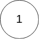

# Day5 content

[A. Linked List Cycle II](#a-linked-list-cycle-ii)

[B. Valid Anagram](#b-valid-anagram)

[C. Ransom Note](#c-ransom-note)

[D. Group Anagrams](#d-group-anagrams)

[E. Find All Anagrams in a String](#e-find-all-anagrams-in-a-string)

[F. Intersection of Two Arrays](#f-intersection-of-two-arrays)

[Review Time Table](#review-time-table)


## A. Linked List Cycle II

Given the `head` of a linked list, return *the node where the cycle begins. If there is no cycle, return `null`*.

There is a cycle in a linked list if there is some node in the list that can be reached again by continuously following the `next` pointer. Internally, `pos` is used to denote the index of the node that tail's `next` pointer is connected to (**0-indexed**). It is `-1` if there is no cycle. **Note that `pos` is not passed as a parameter**.

**Do not modify** the linked list.

 
**Example 1:**


> **Input:** head = [3,2,0,-4], pos = 1
**Output:** tail connects to node index 1
**Explanation:** There is a cycle in the linked list, where tail connects to the second node.

**Example 2:**


> **Input:** head = [1,2], pos = 0
**Output:** tail connects to node index 0
**Explanation:** There is a cycle in the linked list, where tail connects to the first node.

**Example 3:**



> **Input:** head = [1], pos = -1
**Output:** no cycle
**Explanation:** There is no cycle in the linked list.
 

**Constraints:**

- The number of the nodes in the list is in the range [0, $10^4$].
- $-10^5$ <= Node.val <= $10^5$
- `pos` is `-1` or a **valid index** in the linked-list.
 

**Follow up:** Can you solve it using `O(1)` (i.e. constant) memory?


```c++
/**
 * Definition for singly-linked list.
 * struct ListNode {
 *     int val;
 *     ListNode *next;
 *     ListNode(int x) : val(x), next(NULL) {}
 * };
 */
class Solution {
public:
    ListNode *detectCycle(ListNode *head) {
        
    }
};
```

[Solution](LLCII.cpp)


## B. Valid Anagram

Given two strings `s` and `t`, return `true` if `t` is an ==anagram== of `s`, and `false` otherwise.

 
**Example 1:**

> **Input:** s = "anagram", t = "nagaram"
**Output:** true

**Example 2:**

> **Input:** s = "rat", t = "car"
**Output:** false

 
**Constraints:**

- 1 <= s.length, t.length <= 5 * $10^4$
- `s` and `t` consist of lowercase English letters.
 

**Follow up:** What if the inputs contain Unicode characters? How would you adapt your solution to such a case?

```c++
class Solution {
public:
    bool isAnagram(string s, string t) {
        
    }
};
```

[Solution](VA.cpp)


[Solution-HashMap(for Unicode characters)](VA_HM.cpp)


## C. Ransom Note

Given two strings `ransomNote` and `magazine`, return `true` *if `ransomNote` can be constructed by using the letters from `magazine` and `false` otherwise*.

Each letter in `magazine` can only be used once in `ransomNote`.


**Example 1:**

> **Input:** ransomNote = "a", magazine = "b"
**Output:** false

**Example 2:**

> **Input:** ransomNote = "aa", magazine = "ab"
**Output:** false

**Example 3:**

> **Input:** ransomNote = "aa", magazine = "aab"
**Output:** true
 

**Constraints:**

- 1 <= ransomNote.length, magazine.length <= $10^5$
- `ransomNote` and `magazine` consist of lowercase English letters.

```c++
class Solution {
public:
    bool canConstruct(string ransomNote, string magazine) {
        
    }
};
```

[Solution](RN.cpp)


## D. Group Anagrams

Given an array of strings `strs`, group the ==anagrams== together. You can return the answer in **any order**.

 
**Example 1:**

> **Input:** strs = ["eat","tea","tan","ate","nat","bat"]
**Output:** [["bat"],["nat","tan"],["ate","eat","tea"]]
**Explanation:**
- There is no string in strs that can be rearranged to form `"bat"`.
- The strings `"nat"` and `"tan"` are anagrams as they can be rearranged to form each other.
- The strings `"ate"`, `"eat"`, and `"tea"` are anagrams as they can be rearranged to form each other.

**Example 2:**

> **Input:** strs = [""]
**Output:** [[""]]

**Example 3:**

> **Input:** strs = ["a"]
**Output:** [["a"]]

 
**Constraints:**

- 1 <= strs.length <= $10^4$
- 0 <= strs[i].length <= 100
- `strs[i]` consists of lowercase English letters.

```c++
class Solution {
public:
    vector<vector<string>> groupAnagrams(vector<string>& strs) {
        
    }
};
```

[Solution](GA.cpp)


## E. Find All Anagrams in a String

Given two strings `s` and `p`, return *an array of all the start indices of `p`'s anagrams in `s`*. You may return the answer in **any order**.

An **Anagram** is a word or phrase formed by rearranging the letters of a different word or phrase, typically using all the original letters exactly once.

 
**Example 1:**

> **Input:** s = "cbaebabacd", p = "abc"
**Output:** [0,6]
**Explanation:**
The substring with start index = 0 is "cba", which is an anagram of "abc".
The substring with start index = 6 is "bac", which is an anagram of "abc".

**Example 2:**

> **Input:** s = "abab", p = "ab"
**Output:** [0,1,2]
**Explanation:**
The substring with start index = 0 is "ab", which is an anagram of "ab".
The substring with start index = 1 is "ba", which is an anagram of "ab".
The substring with start index = 2 is "ab", which is an anagram of "ab".
 

**Constraints:**

- 1 <= s.length, p.length <= 3 * $10^4$
- `s` and `p` consist of lowercase English letters.

```c++
class Solution {
public:
    vector<int> findAnagrams(string s, string p) {
        
    }
};
```

[Solution](FAAS.cpp)


## F. Intersection of Two Arrays

Given two integer arrays `nums1` and `nums2`, return *an array of their ==intersection==*. Each element in the result must be **unique** and you may return the result in **any order**.

 
**Example 1:**

> **Input:** nums1 = [1,2,2,1], nums2 = [2,2]
**Output:** [2]

**Example 2:**

> **Input:** nums1 = [4,9,5], nums2 = [9,4,9,8,4]
**Output:** [9,4]
**Explanation:** [4,9] is also accepted.
 

**Constraints:**

- 1 <= nums1.length, nums2.length <= 1000
- 0 <= nums1[i], nums2[i] <= 1000

```c++
class Solution {
public:
    vector<int> intersection(vector<int>& nums1, vector<int>& nums2) {
        
    }
};
```

[Solution](ITA.cpp)


## Review Time Table

After N Days | Total(time) | A | B | C | D | E | F
1 | 00:42:32 | 00:19:03 | 00:02:24 | 00:02:07 | 00:05:17 | 00:10:50 | 00:02:51