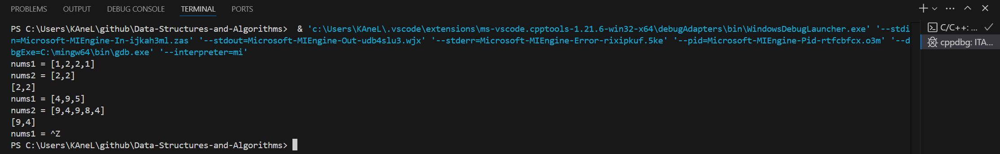
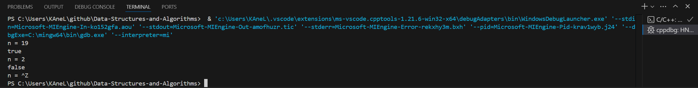
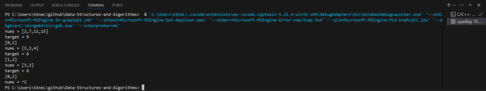
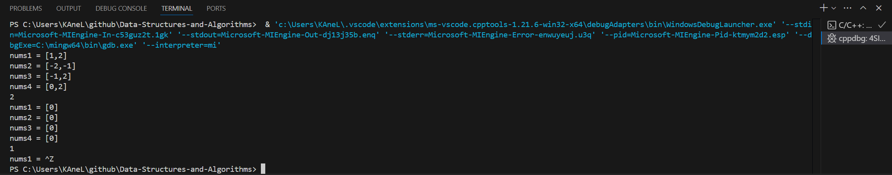
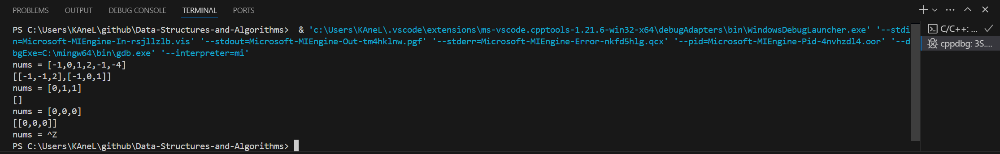
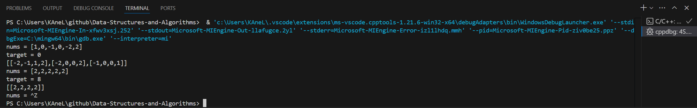

# Day6 content

[A. Intersection of Two Arrays II](#a-intersection-of-two-arrays-ii)

[B. Happy Number](#b-happy-number)

[C. Two Sum](#c-two-sum)

[D. 4Sum II](#d-4sum-ii)

[E. 3Sum](#e-3sum)

[F. 4Sum](#f-4sum)


## A. Intersection of Two Arrays II

Given two integer arrays `nums1` and `nums2`, return *an array of their intersection*. Each element in the result must appear as many times as it shows in both arrays and you may return the result in **any order**.

 
**Example 1:**

> **Input:** nums1 = [1,2,2,1], nums2 = [2,2]
**Output:** [2,2]

**Example 2:**

> **Input:** nums1 = [4,9,5], nums2 = [9,4,9,8,4]
**Output:** [4,9]
**Explanation:** [9,4] is also accepted.
 

**Constraints:**

- 1 <= nums1.length, nums2.length <= 1000
- 0 <= nums1[i], nums2[i] <= 1000
 

**Follow up:**

- What if the given array is already sorted? How would you optimize your algorithm?
- What if `nums1`'s size is small compared to `nums2`'s size? Which algorithm is better?
- What if elements of `nums2` are stored on disk, and the memory is limited such that you cannot load all elements into the memory at once?


```c++
class Solution {
public:
    vector<int> intersect(vector<int>& nums1, vector<int>& nums2) {
        
    }
};
```

[Solution](ITAII.cpp)




## B. Happy Number

Write an algorithm to determine if a number `n` is happy.

A **happy number** is a number defined by the following process:

- Starting with any positive integer, replace the number by the sum of the squares of its digits.
- Repeat the process until the number equals 1 (where it will stay), or it **loops endlessly in a cycle** which does not include 1.
- Those numbers for which this process **ends in 1** are happy.

Return `true` *if `n` is a happy number, and `false` if not*.

 
**Example 1:**

> **Input:** n = 19
**Output:** true
**Explanation:**
12 + 92 = 82
82 + 22 = 68
62 + 82 = 100
12 + 02 + 02 = 1

**Example 2:**

> **Input:** n = 2
**Output:** false
 

**Constraints:**

- 1 <= n <= $2^31$ - 1


```c++
class Solution {
public:
    bool isHappy(int n) {
        
    }
};
```

[Solution](HN.cpp)




## C. Two Sum

Given an array of integers `nums` and an integer `target`, return *indices of the two numbers such that they add up to `target`*.

You may assume that each input would have ***exactly* one solution**, and you may not use the *same* element twice.

You can return the answer in any order.

 
**Example 1:**

> **Input:** nums = [2,7,11,15], target = 9
**Output:** [0,1]
**Explanation:** Because nums[0] + nums[1] == 9, we return [0, 1].

**Example 2:**

> **Input:** nums = [3,2,4], target = 6
**Output:** [1,2]

**Example 3:**

> **Input:** nums = [3,3], target = 6
**Output:** [0,1]
 

**Constraints:**

- 2 <= nums.length <= $10^4$
- $-10^9$ <= nums[i] <= $10^9$
- $-10^9$ <= target <= $10^9$
- **Only one valid answer exists**.
 

**Follow-up:** Can you come up with an algorithm that is less than $O({n}^{2})$ time complexity?


```c++
class Solution {
public:
    vector<int> twoSum(vector<int>& nums, int target) {
        
    }
};
```

[Solution](TS.cpp)




## D. 4Sum II

Given four integer arrays `nums1`, `nums2`, `nums3`, and `nums4` all of length `n`, return the number of tuples `(i, j, k, l)` such that:

- 0 <= i, j, k, l < n
- nums1[i] + nums2[j] + nums3[k] + nums4[l] == 0
 

**Example 1:**

> **Input:** nums1 = [1,2], nums2 = [-2,-1], nums3 = [-1,2], nums4 = [0,2]
**Output:** 2
**Explanation:**
The two tuples are:
1. (0, 0, 0, 1) -> nums1[0] + nums2[0] + nums3[0] + nums4[1] = 1 + (-2) + (-1) + 2 = 0
2. (1, 1, 0, 0) -> nums1[1] + nums2[1] + nums3[0] + nums4[0] = 2 + (-1) + (-1) + 0 = 0

**Example 2:**

> **Input:** nums1 = [0], nums2 = [0], nums3 = [0], nums4 = [0]
**Output:** 1
 

**Constraints:**

- n == nums1.length
- n == nums2.length
- n == nums3.length
- n == nums4.length
- 1 <= n <= 200
- $-2^28$ <= nums1[i], nums2[i], nums3[i], nums4[i] <= $2^28$


```c++
class Solution {
public:
    int fourSumCount(vector<int>& nums1, vector<int>& nums2, vector<int>& nums3, vector<int>& nums4) {
        
    }
};
```

[Solution](4SII.cpp)




## E. 3Sum

Given an integer array nums, return all the triplets `[nums[i], nums[j], nums[k]]` such that `i != j`, `i != k`, and `j != k`, and `nums[i] + nums[j] + nums[k] == 0`.

Notice that the solution set must not contain duplicate triplets.

 
**Example 1:**

> **Input:** nums = [-1,0,1,2,-1,-4]
**Output:** [[-1,-1,2],[-1,0,1]]
**Explanation:** 
nums[0] + nums[1] + nums[2] = (-1) + 0 + 1 = 0.
nums[1] + nums[2] + nums[4] = 0 + 1 + (-1) = 0.
nums[0] + nums[3] + nums[4] = (-1) + 2 + (-1) = 0.
The distinct triplets are [-1,0,1] and [-1,-1,2].
Notice that the order of the output and the order of the triplets does not matter.

**Example 2:**

> **Input:** nums = [0,1,1]
**Output:** []
**Explanation:** The only possible triplet does not sum up to 0.

**Example 3:**

> **Input:** nums = [0,0,0]
**Output:** [[0,0,0]]
**Explanation:** The only possible triplet sums up to 0.
 

**Constraints:**

- 3 <= nums.length <= 3000
- $-10^5$ <= nums[i] <= $10^5$


```c++
class Solution {
public:
    vector<vector<int>> threeSum(vector<int>& nums) {
        
    }
};
```

[Solution](3S.cpp)




## F. 4Sum

Given an array `nums` of `n` integers, return *an array of all the unique quadruplets* `[nums[a], nums[b], nums[c], nums[d]]` such that:

- 0 <= a, b, c, d < n
- `a`, `b`, `c`, and `d` are **distinct**.
- nums[a] + nums[b] + nums[c] + nums[d] == target

You may return the answer in **any order**.

 
**Example 1:**

> **Input:** nums = [1,0,-1,0,-2,2], target = 0
**Output:** [[-2,-1,1,2],[-2,0,0,2],[-1,0,0,1]]

**Example 2:**

> **Input:** nums = [2,2,2,2,2], target = 8
**Output:** [[2,2,2,2]]
 

**Constraints:**

- 1 <= nums.length <= 200
- $-10^9$ <= nums[i] <= $10^9$
- $-10^9$ <= target <= $10^9$


```c++
class Solution {
public:
    vector<vector<int>> fourSum(vector<int>& nums, int target) {
        
    }
};
```

[Solution](4S.cpp)




