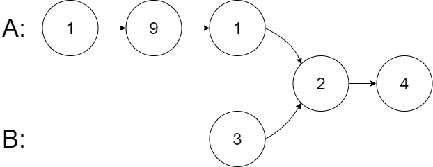

# Day4 content

[A. Remove Linked List Elements](#a-remove-linked-list-elements)

[B. Design Linked List](#b-design-linked-list)

[C. Reverse Linked List](#c-reverse-linked-list)

[D. Swap Nodes in Pairs](#d-swap-nodes-in-pairs)

[E. Remove Nth Node From End of List](#e-remove-nth-node-from-end-of-list)

[F. Intersection of Two Linked Lists](#f-intersection-of-two-linked-lists)

[Review Time Table](#review-time-table)


## A. Remove Linked List Elements

Given the `head` of a linked list and an integer `val`, remove all the nodes of the linked list that has `Node.val == val`, and return *the new head*.

 
**Example 1:**


> **Input:** head = [1,2,6,3,4,5,6], val = 6
**Output:** [1,2,3,4,5]

**Example 2:**

> **Input:** head = [], val = 1
**Output:** []

**Example 3:**

> **Input:** head = [7,7,7,7], val = 7
**Output:** []
 

**Constraints:**

- The number of nodes in the list is in the range [0, $10^4$].
- 1 <= Node.val <= 50
- 0 <= val <= 50

```c++
/**
 * Definition for singly-linked list.
 * struct ListNode {
 *     int val;
 *     ListNode *next;
 *     ListNode() : val(0), next(nullptr) {}
 *     ListNode(int x) : val(x), next(nullptr) {}
 *     ListNode(int x, ListNode *next) : val(x), next(next) {}
 * };
 */
class Solution {
public:
    ListNode* removeElements(ListNode* head, int val) {
        
    }
};
```

[Solution](RLLE.cpp)


## B. Design Linked List

Design your implementation of the linked list. You can choose to use a singly or doubly linked list.
A node in a singly linked list should have two attributes: `val` and `next`. `val` is the value of the current node, and `next` is a pointer/reference to the next node.
If you want to use the doubly linked list, you will need one more attribute `prev` to indicate the previous node in the linked list. Assume all nodes in the linked list are 0-indexed.

Implement the `MyLinkedList` class:

- `MyLinkedList()` Initializes the `MyLinkedList` object.
- `int get(int index)` Get the value of the ${index}^{th}$ node in the linked list. If the index is invalid, return `-1`.
- `void addAtHead(int val)` Add a node of value `val` before the first element of the linked list. After the insertion, the new node will be the first node of the linked list.
- `void addAtTail(int val)` Append a node of value `val` as the last element of the linked list.
- `void addAtIndex(int index, int val)` Add a node of value `val` before the ${index}^{th}$ node in the linked list. If `index` equals the length of the linked list, the node will be appended to the end of the linked list. If `index` is greater than the length, the node **will not be inserted**.
- `void deleteAtIndex(int index)` Delete the ${index}^{th}$ node in the linked list, if the index is valid.
 

**Example 1:**

> **Input**
["MyLinkedList", "addAtHead", "addAtTail", "addAtIndex", "get", "deleteAtIndex", "get"]
[[], [1], [3], [1, 2], [1], [1], [1]]
**Output**
[null, null, null, null, 2, null, 3]
> 
**Explanation**
MyLinkedList myLinkedList = new MyLinkedList();
myLinkedList.addAtHead(1);
myLinkedList.addAtTail(3);
myLinkedList.addAtIndex(1, 2);    // linked list becomes 1->2->3
myLinkedList.get(1);              // return 2
myLinkedList.deleteAtIndex(1);    // now the linked list is 1->3
myLinkedList.get(1);              // return 3
 

**Constraints:**

- 0 <= index, val <= 1000
- Please do not use the built-in LinkedList library.
- At most `2000` calls will be made to `get`, `addAtHead`, `addAtTail`, `addAtIndex` and `deleteAtIndex`.

```c++
class MyLinkedList {
public:
    MyLinkedList() {
        
    }
    
    int get(int index) {
        
    }
    
    void addAtHead(int val) {
        
    }
    
    void addAtTail(int val) {
        
    }
    
    void addAtIndex(int index, int val) {
        
    }
    
    void deleteAtIndex(int index) {
        
    }
};

/**
 * Your MyLinkedList object will be instantiated and called as such:
 * MyLinkedList* obj = new MyLinkedList();
 * int param_1 = obj->get(index);
 * obj->addAtHead(val);
 * obj->addAtTail(val);
 * obj->addAtIndex(index,val);
 * obj->deleteAtIndex(index);
 */
```

[Solution](DLL.cpp)


## C. Reverse Linked List

Given the `head` of a singly linked list, reverse the list, and return *the reversed list*.

 
**Example 1:**


> **Input:** head = [1,2,3,4,5]
**Output:** [5,4,3,2,1]

**Example 2:**


> **Input:** head = [1,2]
**Output:** [2,1]

**Example 3:**

> **Input:** head = []
**Output:** []
 

**Constraints:**

- The number of nodes in the list is the range [0, 5000].
- -5000 <= Node.val <= 5000
 

**Follow up:** A linked list can be reversed either iteratively or recursively. Could you implement both?

```c++
/**
 * Definition for singly-linked list.
 * struct ListNode {
 *     int val;
 *     ListNode *next;
 *     ListNode() : val(0), next(nullptr) {}
 *     ListNode(int x) : val(x), next(nullptr) {}
 *     ListNode(int x, ListNode *next) : val(x), next(next) {}
 * };
 */
class Solution {
public:
    ListNode* reverseList(ListNode* head) {

    }
};
```

[Solution-iteratively](RLL_I.cpp)


[Solution-recursively](RLL_R.cpp)


## D. Swap Nodes in Pairs

Given a linked list, swap every two adjacent nodes and return its head. You must solve the problem without modifying the values in the list's nodes (i.e., only nodes themselves may be changed.)

 
**Example 1:**

> **Input:** head = [1,2,3,4]
**Output:** [2,1,4,3]
**Explanation:**


**Example 2:**

> **Input:** head = []
**Output:** []

**Example 3:**

> **Input:** head = [1]
**Output:** [1]

**Example 4:**

> **Input:** head = [1,2,3]
**Output:** [2,1,3]

 
**Constraints:**

- The number of nodes in the list is in the range [0, 100].
- 0 <= Node.val <= 100

```c++
/**
 * Definition for singly-linked list.
 * struct ListNode {
 *     int val;
 *     ListNode *next;
 *     ListNode() : val(0), next(nullptr) {}
 *     ListNode(int x) : val(x), next(nullptr) {}
 *     ListNode(int x, ListNode *next) : val(x), next(next) {}
 * };
 */
class Solution {
public:
    ListNode* swapPairs(ListNode* head) {
        
    }
};
```

[Solution](SNP.cpp)


## E. Remove Nth Node From End of List

Given the `head` of a linked list, remove the ${n}^{th}$ node from the end of the list and return its head.

 
**Example 1:**


> **Input:** head = [1,2,3,4,5], n = 2
**Output:** [1,2,3,5]

**Example 2:**

> **Input:** head = [1], n = 1
**Output:** []

**Example 3:**

> **Input:** head = [1,2], n = 1
**Output:** [1]
 

**Constraints:**

- The number of nodes in the list is `sz`.
- 1 <= sz <= 30
- 0 <= Node.val <= 100
- 1 <= n <= sz
 

**Follow up:** Could you do this in one pass?

```c++
/**
 * Definition for singly-linked list.
 * struct ListNode {
 *     int val;
 *     ListNode *next;
 *     ListNode() : val(0), next(nullptr) {}
 *     ListNode(int x) : val(x), next(nullptr) {}
 *     ListNode(int x, ListNode *next) : val(x), next(next) {}
 * };
 */
class Solution {
public:
    ListNode* removeNthFromEnd(ListNode* head, int n) {
        
    }
};
```

[Solution](RNNFEL.cpp)


## F. Intersection of Two Linked Lists

Given the heads of two singly linked-lists `headA` and `headB`, return *the node at which the two lists intersect*. If the two linked lists have no intersection at all, return `null`.

For example, the following two linked lists begin to intersect at node `c1`:


The test cases are generated such that there are no cycles anywhere in the entire linked structure.

**Note** that the linked lists must **retain their original structure** after the function returns.

**Custom Judge:**

The inputs to the **judge** are given as follows (your program is **not** given these inputs):

- `intersectVal` - The value of the node where the intersection occurs. This is `0` if there is no intersected node.
- `listA` - The first linked list.
- `listB` - The second linked list.
- `skipA` - The number of nodes to skip ahead in `listA` (starting from the head) to get to the intersected node.
- `skipB` - The number of nodes to skip ahead in `listB` (starting from the head) to get to the intersected node.

The judge will then create the linked structure based on these inputs and pass the two heads, `headA` and `headB` to your program. If you correctly return the intersected node, then your solution will be **accepted**.

 
**Example 1:**


> **Input:** intersectVal = 8, listA = [4,1,8,4,5], listB = [5,6,1,8,4,5], skipA = 2, skipB = 3
**Output:** Intersected at '8'
**Explanation:** The intersected node's value is 8 (note that this must not be 0 if the two lists intersect).
From the head of A, it reads as [4,1,8,4,5]. From the head of B, it reads as [5,6,1,8,4,5]. There are 2 nodes before the intersected node in A; There are 3 nodes before the intersected node in B.
> - Note that the intersected node's value is not 1 because the nodes with value 1 in A and B (2nd node in A and 3rd node in B) are different node references. In other words, they point to two different locations in memory, while the nodes with value 8 in A and B (3rd node in A and 4th node in B) point to the same location in memory.

**Example 2:**



> **Input:** intersectVal = 2, listA = [1,9,1,2,4], listB = [3,2,4], skipA = 3, skipB = 1
**Output:** Intersected at '2'
**Explanation:** The intersected node's value is 2 (note that this must not be 0 if the two lists intersect).
From the head of A, it reads as [1,9,1,2,4]. From the head of B, it reads as [3,2,4]. There are 3 nodes before the intersected node in A; There are 1 node before the intersected node in B.

**Example 3:**


> **Input:** intersectVal = 0, listA = [2,6,4], listB = [1,5], skipA = 3, skipB = 2
**Output:** No intersection
**Explanation:** From the head of A, it reads as [2,6,4]. From the head of B, it reads as [1,5]. Since the two lists do not intersect, intersectVal must be 0, while skipA and skipB can be arbitrary values.
Explanation: The two lists do not intersect, so return null.
 

**Constraints:**

- The number of nodes of `listA` is in the `m`.
- The number of nodes of `listB` is in the `n`.
- 1 <= m, n <= 3 * 104
- 1 <= Node.val <= 105
- 0 <= skipA < m
- 0 <= skipB < n
- `intersectVal` is `0` if `listA` and `listB` do not intersect.
- `intersectVal == listA[skipA] == listB[skipB]` if `listA` and `listB` intersect.
 

**Follow up:** Could you write a solution that runs in `O(m + n)` time and use only `O(1)` memory?

```c++
/**
 * Definition for singly-linked list.
 * struct ListNode {
 *     int val;
 *     ListNode *next;
 *     ListNode(int x) : val(x), next(NULL) {}
 * };
 */
class Solution {
public:
    ListNode *getIntersectionNode(ListNode *headA, ListNode *headB) {
        
    }
};
```

[Solution](ITLL.cpp)


## Review Time Table

After N Days | Total(time) | A | B | C | D | E | F
1 | 01:31:17 | 00:10:16 | 00:17:56 | 00:31:56 | 00:12:11 | 00:08:19 | 00:10:39