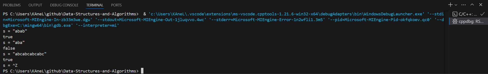
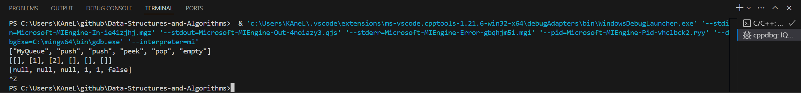
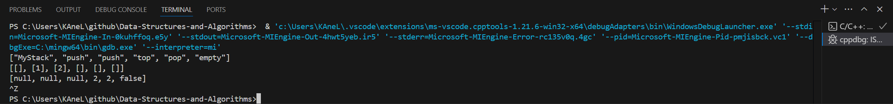
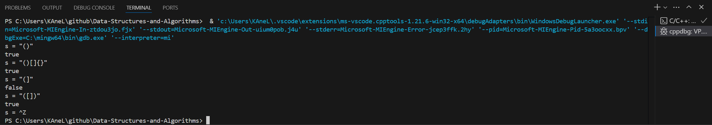
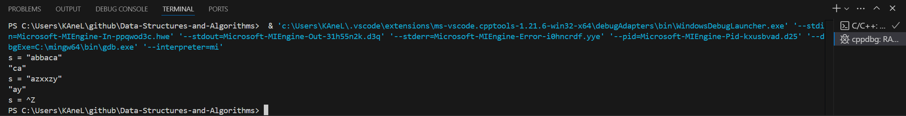
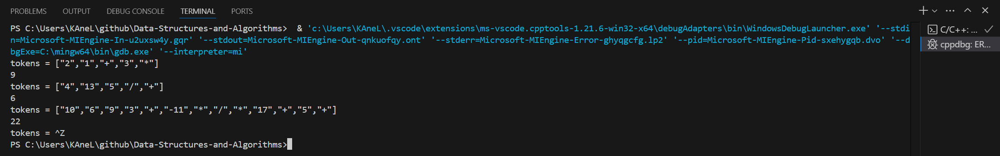

# Day8 content

[A. Repeated Substring Pattern](#a-repeated-substring-pattern)

[B. Implement Queue using Stacks](#b-implement-queue-using-stacks)

[C. Implement Stack using Queues](#c-implement-stack-using-queues)

[D. Valid Parentheses](#d-valid-parentheses)

[E. Remove All Adjacent Duplicates In String](#e-remove-all-adjacent-duplicates-in-string)

[F. Evaluate Reverse Polish Notation](#f-evaluate-reverse-polish-notation)

[Review Time Table](#review-time-table)


## A. Repeated Substring Pattern

Given a string `s`, check if it can be constructed by taking a substring of it and appending multiple copies of the substring together.

 
**Example 1:**

> **Input:** s = "abab"
**Output:** true
**Explanation:** It is the substring "ab" twice.

**Example 2:**

> **Input:** s = "aba"
**Output:** false

**Example 3:**

> **Input:** s = "abcabcabcabc"
**Output:** true
**Explanation:** It is the substring "abc" four times or the substring "abcabc" twice.
 

**Constraints:**

- 1 <= s.length <= $10^4$
- `s` consists of lowercase English letters.


```c++
class Solution {
public:
    bool repeatedSubstringPattern(string s) {
        
    }
};
```

[Solution](../String/RSP.cpp)




## B. Implement Queue using Stacks

Implement a first in first out (FIFO) queue using only two stacks. The implemented queue should support all the functions of a normal queue (`push`, `peek`, `pop`, and `empty`).

Implement the `MyQueue` class:

- `void push(int x)` Pushes element x to the back of the queue.
- `int pop()` Removes the element from the front of the queue and returns it.
- `int peek()` Returns the element at the front of the queue.
- `boolean empty()` Returns `true` if the queue is empty, `false` otherwise.

**Notes:**

- You must use **only** standard operations of a stack, which means only `push to top`, `peek/pop from top`, `size`, and `is empty` operations are valid.
- Depending on your language, the stack may not be supported natively. You may simulate a stack using a list or deque (double-ended queue) as long as you use only a stack's standard operations.
 

**Example 1:**

> **Input**
["MyQueue", "push", "push", "peek", "pop", "empty"]
[[], [1], [2], [], [], []]
**Output**
[null, null, null, 1, 1, false]
**Explanation**
MyQueue myQueue = new MyQueue();
myQueue.push(1); // queue is: [1]
myQueue.push(2); // queue is: [1, 2] (leftmost is front of the queue)
myQueue.peek(); // return 1
myQueue.pop(); // return 1, queue is [2]
myQueue.empty(); // return false
 

**Constraints:**

- 1 <= x <= 9
- At most `100` calls will be made to `push`, `pop`, `peek`, and `empty`.
- All the calls to `pop` and `peek` are valid.
 

**Follow-up:** Can you implement the queue such that each operation is ==amortized== `O(1)` time complexity? In other words, performing `n` operations will take overall `O(n)` time even if one of those operations may take longer.


```c++
class MyQueue {
public:
    MyQueue() {
        
    }
    
    void push(int x) {
        
    }
    
    int pop() {
        
    }
    
    int peek() {
        
    }
    
    bool empty() {
        
    }
};

/**
 * Your MyQueue object will be instantiated and called as such:
 * MyQueue* obj = new MyQueue();
 * obj->push(x);
 * int param_2 = obj->pop();
 * int param_3 = obj->peek();
 * bool param_4 = obj->empty();
 */
```

[Solution](IQS.cpp)




## C. Implement Stack using Queues

Implement a last-in-first-out (LIFO) stack using only two queues. The implemented stack should support all the functions of a normal stack (`push`, `top`, `pop`, and `empty`).

Implement the `MyStack` class:

- `void push(int x)` Pushes element x to the top of the stack.
- `int pop()` Removes the element on the top of the stack and returns it.
- `int top()` Returns the element on the top of the stack.
- `boolean empty()` Returns `true` if the stack is empty, `false` otherwise.

**Notes:**

- You must use **only** standard operations of a queue, which means that only `push to back`, `peek/pop from front`, `size` and `is empty` operations are valid.
- Depending on your language, the queue may not be supported natively. You may simulate a queue using a list or deque (double-ended queue) as long as you use only a queue's standard operations.
 

**Example 1:**

> **Input**
["MyStack", "push", "push", "top", "pop", "empty"]
[[], [1], [2], [], [], []]
**Output**
[null, null, null, 2, 2, false]
**Explanation**
MyStack myStack = new MyStack();
myStack.push(1);
myStack.push(2);
myStack.top(); // return 2
myStack.pop(); // return 2
myStack.empty(); // return False
 

**Constraints:**

- 1 <= x <= 9
- At most `100` calls will be made to `push`, `pop`, `top`, and `empty`.
- All the calls to `pop` and `top` are valid.
 

**Follow-up:** Can you implement the stack using only one queue?


```c++
class MyStack {
public:
    MyStack() {
        
    }
    
    void push(int x) {
        
    }
    
    int pop() {
        
    }
    
    int top() {
        
    }
    
    bool empty() {
        
    }
};

/**
 * Your MyStack object will be instantiated and called as such:
 * MyStack* obj = new MyStack();
 * obj->push(x);
 * int param_2 = obj->pop();
 * int param_3 = obj->top();
 * bool param_4 = obj->empty();
 */
```

[Solution](ISQ.cpp)




## D. Valid Parentheses

Given a string `s` containing just the characters `'('`, `')'`, `'{'`, `'}'`, `'['` and `']'`, determine if the input string is valid.

An input string is valid if:

1. Open brackets must be closed by the same type of brackets.
2. Open brackets must be closed in the correct order.
3. Every close bracket has a corresponding open bracket of the same type.
 

**Example 1:**

> **Input:** s = "()"
**Output:** true

**Example 2:**

> **Input:** s = "()[]{}"
**Output:** true

**Example 3:**

> **Input:** s = "(]"
**Output:** false

**Example 4:**

> **Input:** s = "([])"
**Output:** true

 
**Constraints:**

- 1 <= s.length <= $10^4$
- `s` consists of parentheses only `'()[]{}'`.


```c++
class Solution {
public:
    bool isValid(string s) {
        
    }
};
```

[Solution](VP.cpp)




## E. Remove All Adjacent Duplicates In String

You are given a string `s` consisting of lowercase English letters. A **duplicate removal** consists of choosing two **adjacent** and **equal** letters and removing them.

We repeatedly make **duplicate removals** on `s` until we no longer can.

Return *the final string after all such duplicate removals have been made*. It can be proven that the answer is **unique**.

 
**Example 1:**

> **Input:** s = "abbaca"
**Output:** "ca"
**Explanation:** 
For example, in "abbaca" we could remove "bb" since the letters are adjacent and equal, and this is the only possible move.  The result of this move is that the string is "aaca", of which only "aa" is possible, so the final string is "ca".

**Example 2:**

> **Input:** s = "azxxzy"
**Output:** "ay"
 

**Constraints:**

- 1 <= s.length <= $10^5$
- `s` consists of lowercase English letters.


```c++
class Solution {
public:
    string removeDuplicates(string s) {
        
    }
};
```

[Solution](RAADIS.cpp)




## F. Evaluate Reverse Polish Notation

You are given an array of strings `tokens` that represents an arithmetic expression in a ==Reverse Polish Notation==.

Evaluate the expression. Return *an integer that represents the value of the expression*.

**Note** that:

- The valid operators are `'+'`, `'-'`, `'*'`, and `'/'`.
- Each operand may be an integer or another expression.
- The division between two integers always **truncates toward zero**.
- There will not be any division by zero.
- The input represents a valid arithmetic expression in a reverse polish notation.
- The answer and all the intermediate calculations can be represented in a **32-bit** integer.
 

**Example 1:**

> **Input:** tokens = ["2","1","+","3","*"]
**Output:** 9
**Explanation:** ((2 + 1) * 3) = 9

**Example 2:**

> **Input:** tokens = ["4","13","5","/","+"]
**Output:** 6
**Explanation:** (4 + (13 / 5)) = 6

**Example 3:**

> **Input:** tokens = ["10","6","9","3","+","-11","*","/","*","17","+","5","+"]
**Output:** 22
**Explanation:** ((10 * (6 / ((9 + 3) * -11))) + 17) + 5
= ((10 * (6 / (12 * -11))) + 17) + 5
= ((10 * (6 / -132)) + 17) + 5
= ((10 * 0) + 17) + 5
= (0 + 17) + 5
= 17 + 5
= 22
 

**Constraints:**

- 1 <= tokens.length <= $10^4$
- `tokens[i]` is either an operator: `"+"`, `"-"`, `"*"`, or `"/"`, or an integer in the range `[-200, 200]`.


```c++
class Solution {
public:
    int evalRPN(vector<string>& tokens) {
        
    }
};
```

[Solution](ERPN.cpp)




## Review Time Table

After N Days | Total(time) | A | B | C | D | E | F
1 | 00:36:07 | 00:08:03 | 00:09:20 | 00:02:57 | 00:04:45 | 00:05:16 | 00:05:46
2 | 00:25:39 | 00:06:37 | 00:03:12 | 00:02:40 | 00:04:28 | 00:04:22 | 00:04:20