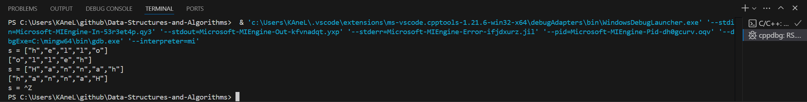
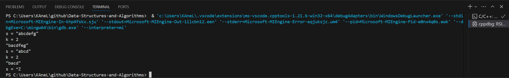
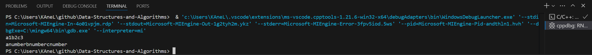
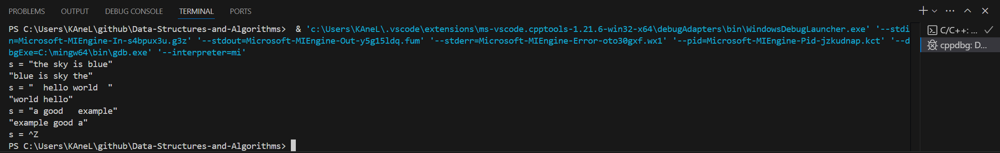
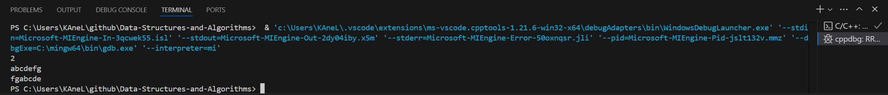
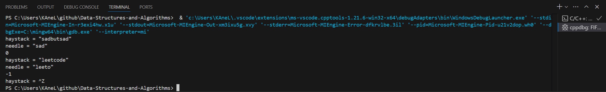

# Day7 content

[A. Reverse String](#a-reverse-string)

[B. Reverse String II](#b-reverse-string-ii)

[C. Replace Numbers](#c-replace-numbers)

[D. Reverse Words in a String](#d-reverse-words-in-a-string)

[E. Right Rotate String](#e-right-rotate-string)

[F. Find the Index of the First Occurrence in a String](#f-find-the-index-of-the-first-occurrence-in-a-string)

[Review Time Table](#review-time-table)


## A. Reverse String

Write a function that reverses a string. The input string is given as an array of characters `s`.

You must do this by modifying the input array ==in-place== with `O(1)` extra memory.

 
**Example 1:**

> **Input:** s = ["h","e","l","l","o"]
**Output:** ["o","l","l","e","h"]

**Example 2:**

> **Input:** s = ["H","a","n","n","a","h"]
**Output:** ["h","a","n","n","a","H"]
 

**Constraints:**

- 1 <= s.length <= $10^5$
- `s[i]` is a ==printable ascii character==.


```c++
class Solution {
public:
    void reverseString(vector<char>& s) {
        
    }
};
```

[Solution](RS.cpp)




## B. Reverse String II

Given a string `s` and an integer `k`, reverse the first `k` characters for every `2k` characters counting from the start of the string.

If there are fewer than `k` characters left, reverse all of them. If there are less than `2k` but greater than or equal to `k` characters, then reverse the first `k` characters and leave the other as original.

 
**Example 1:**

> **Input:** s = "abcdefg", k = 2
**Output:** "bacdfeg"

**Example 2:**

> **Input:** s = "abcd", k = 2
**Output:** "bacd"
 

**Constraints:**

- 1 <= s.length <= $10^4$
- `s` consists of only lowercase English letters.
- 1 <= k <= $10^4$


```c++
class Solution {
public:
    string reverseStr(string s, int k) {
        
    }
};
```

[Solution](RSII.cpp)




## C. Replace Numbers

Given a string `s` that contains **lowercase letters and digit characters**, please write a function that keeps the letter characters unchanged while *replacing each digit character with `number`.*

**Example 1:**

> **Input:** a1b2c3
**Output:** anumberbnumbercnumber


**Constraints:**
- 1 <= s.length < 10000


[Solution](RN.cpp)




## D. Reverse Words in a String

Given an input string `s`, reverse the order of the **words**.

A **word** is defined as a sequence of non-space characters. The **words** in `s` will be separated by at least one space.

Return *a string of the words in reverse order concatenated by a single space*.

**Note** that `s` may contain leading or trailing spaces or multiple spaces between two words. The returned string should only have a single space separating the words. Do not include any extra spaces.

 
**Example 1:**

> **Input:** s = "the sky is blue"
**Output:** "blue is sky the"

**Example 2:**

> **Input:** s = "  hello world  "
**Output:** "world hello"
**Explanation:** Your reversed string should not contain leading or trailing spaces.

**Example 3:**

> **Input:** s = "a good   example"
**Output:** "example good a"
**Explanation:** You need to reduce multiple spaces between two words to a single space in the reversed string.
 

**Constraints:**

- 1 <= s.length <= $10^4$
- `s` contains English letters (upper-case and lower-case), digits, and spaces `' '`.
- There is **at least one** word in `s`.
 

**Follow-up:** If the string data type is mutable in your language, can you solve it **in-place** with `O(1)` extra space?


```c++
class Solution {
public:
    string reverseWords(string s) {
        
    }
};
```

[Solution](DWS.cpp)




## E. Right Rotate String

Given a string `s` and a positive integer `k`, please write a function that *moves the last k characters of the string to the front*, effectively performing the right rotation operation on the string.

The **right rotation operation** on a string involves moving a certain number of characters from the end of the string to the front.


**Example 1:**

> **Input:** (The input consists of two lines: the first line is a positive integer k, representing the number of positions to rotate right. The second line is the string s, representing the string to be rotated.)
2
abcdefg
**Output:** fgabcde


**Constraints:**

- 1 <= k < $10^4$
- 1 <= s.length < $10^4$;

[Solution](RRS.cpp)




## F. Find the Index of the First Occurrence in a String

Given two strings `needle` and `haystack`, return the index of the first occurrence of `needle` in `haystack`, or `-1` if `needle` is not part of `haystack`.

 
**Example 1:**

> **Input:** haystack = "sadbutsad", needle = "sad"
**Output:** 0
**Explanation:** "sad" occurs at index 0 and 6.
The first occurrence is at index 0, so we return 0.

**Example 2:**

> **Input:** haystack = "leetcode", needle = "leeto"
**Output:** -1
**Explanation:** "leeto" did not occur in "leetcode", so we return -1.
 

**Constraints:**

- 1 <= haystack.length, needle.length <= $10^4$
- `haystack` and `needle` consist of only lowercase English characters.


```c++
class Solution {
public:
    int strStr(string haystack, string needle) {
        
    }
};
```

[Solution](FIFOS.cpp)




## Review Time Table

After N Days | Total(time) | A | B | C | D | E | F
1 | 01:25:12 | 00:00:50 | 00:17:07 | 00:01:10 | 00:21:27 | 00:01:05 | 00:06:31
2 | 00:41:29 | 00:03:53 | 00:04:42 | 00:01:08 | 00:20:47 | 00:01:17 | 00:09:42